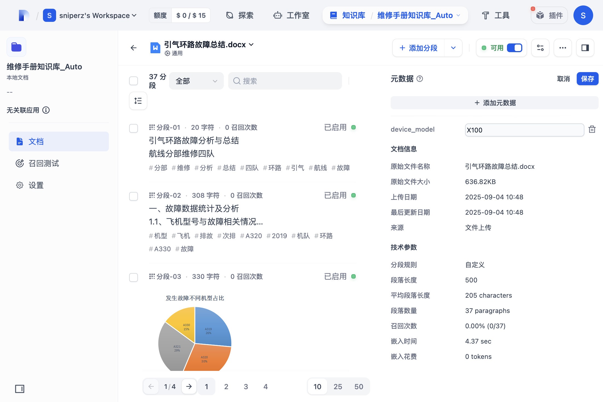

## 用户操作手册（知识库管理 v1.0）

本手册面向零经验用户，提供从“创建知识库 → 上传与索引文档 → 元数据管理 → 检索测试与引用 → 文档与分段维护”的端到端操作说明与故障排除。所有截图按标准 Markdown 语法嵌入并置于 images/ 目录。

- 截图引用规范：``（相对路径）
- 示例：``
- 已采集截图清单：访问_1.png / 新建知识库_1.png / 新建知识库_2.png / 上传文档_1~5.png / 元数据管理_1~3.png / 检索测试_1~2.png
- 说明：本版本聚焦“知识库使用”文字指引，截图仅对核心环节保留；“文档与分段/更新索引”章节以文字说明为主，可按需后续补图。

---

### 快速上手（3 分钟）
- 1) 创建知识库：在“知识库”列表点击“创建”，填写名称与权限范围
- 2) 上传与索引：进入文档页，上传 PDF/DOCX/MD，点击“保存并处理”（自动分段与索引）
- 3) 元数据（可选）：在文档详情右侧“元数据”卡添加 device_model 等字段，便于过滤
- 4) 检索验证：转到“召回测试”，输入查询词，查看召回片段与引用来源
- 5) 更新索引：文档详情 → 设置 → 保存并处理（变更分段/规则后重新索引）

---

### 0. 前置条件与环境
- 访问地址：http://app.anyremote.cn:8183/datasets（已登录）
- 浏览器：Chrome 最新版（禁用影响渲染的扩展）
- 账号权限：具备“知识库创建、文档上传、元数据管理、检索测试”权限
- 测试数据：本地准备 PDF / DOCX / MD 各 1~2 份
- 截图规则：采集关键步骤“操作前 / 操作中 / 操作后 / 错误示例”；标注关键区域（红框/箭头/标题）

### 1. 导航路径与界面定位
- 知识库列表页：顶部导航 → 知识库 → 列表
  - 示例界面：
- 知识库详情页：知识库列表页 → 点击库名称 → 进入“文档 / 召回测试 / 设置”等标签页
- 文档详情页：知识库详情页 → 文档标签页 → 点击某一文档

---

## 功能一：创建知识库

#### 1.1 正常创建
- 导航路径：知识库列表页 → 创建知识库
- 前置条件：已登录，名称未被占用
- 操作步骤：
  1) 点击“创建知识库/创建一个空知识库”
  2) 在“知识库名称”输入：维修手册知识库_Auto
  3) 权限范围选择：only_me（或其他）
  4) 点击“创建”
- 预期结果：
  - 创建成功并跳转到该知识库详情页；列表中可见该条目
- 故障排除：
  - 若提示 401/403：检查账号权限与登录状态
- 操作提示/注意事项：
  - 名称建议唯一、易识别；权限范围可后续在“设置”中调整
- 截图：
  - 填写表单与创建按钮：
  - 创建成功后进入文档页：

#### 1.2 名称冲突（409）
- 导航路径：知识库列表页 → 创建知识库
- 前置条件：存在同名知识库
- 操作步骤：重复输入已存在名称并点击“创建”
- 预期结果：弹出“名称已存在/409 冲突”提示，创建被阻断
- 故障排除：改用唯一名称或在原库内继续操作
- 截图：

---

## 功能二：上传与索引文档

#### 2.1 单/批量上传
- 导航路径：知识库列表页 → 点击库名称 → 文档标签页
- 前置条件：知识库存在；本地有待上传文件
- 操作步骤：
  1) 点击“添加文件”
  2) 在操作系统选择器中选择待上传文件（PDF/DOCX/MD）
  3) 点击“下一步”进入“分段/清洗与索引设置”
  4) 按需要勾选分段规则与索引方法（保持默认也可）
  5) 点击“保存并处理”
- 预期结果：
  - 文档状态流转 uploaded → parsing → indexing → 可用（enabled）
- 故障排除：
  - 502/Bad Gateway：改为单文件重试；检查网络与后端负载
  - 长时间停留在 parsing/indexing：刷新查看；必要时取消本次并重试
- 操作提示/注意事项：
  - 首次建议先上传较小文件验证流程
- 截图：
  - 文档页初始/空态：
  - 已选文件列表：
  - 分段/索引设置页：
  - 处理中：
  - 完成可用：

---

## 功能三：元数据管理

#### 3.1 创建元数据字段
- 导航路径：知识库详情页 → 顶部操作区 → 元数据（或设置→元数据）
- 前置条件：具备字段管理权限
- 操作步骤：
  1) 点击“添加元数据”
  2) 名称输入：device_model（小写/数字/下划线）
  3) 类型选择：string
  4) 点击“保存”
- 预期结果：字段创建成功，显示在字段列表
- 故障排除：
  - 非法命名/重复名称：按提示修正；名称需唯一
- 提示/注意：命名规范统一，避免后续筛选/集成混乱
- 截图：

#### 3.2 单个文档赋值（示例：DOCX/PDF）
- 导航路径：知识库详情页 → 文档标签页 → 点击某文档 → 详情页右侧“元数据”
- 前置条件：已创建字段 device_model
- 操作步骤：
  1) 点击“添加元数据”
  2) 下拉选择 device_model
  3) 在值输入框输入：X100
  4) 点击“保存”
- 预期结果：文档详情“元数据”卡片显示 device_model=X100
- 故障排除：
  - 保存失败：检查字段是否存在、值格式是否符合类型
- 提示/注意：常用元数据建议统一枚举值，减少拼写差异
- 截图：
  - 赋值前编辑态：
  - 保存成功后：

#### 3.3 字段类型验证（示例）
- 前置条件：存在 number / date 等类型字段
- 操作步骤：尝试输入与类型不匹配的值并保存
- 预期结果：前端校验或保存失败提示
- 故障排除：按类型规则修正格式（如日期 YYYY-MM-DD）
- 提示/注意：统一时区/日期格式，避免检索过滤偏差

#### 3.4 批量赋值（若 UI 支持）
- 操作步骤：在文档列表批量勾选 → 批量操作 → 批量设置元数据 → 设置 device_model=X100 → 确认
- 预期结果：被选中文档均写入该元数据
- 故障排除：部分失败需逐条核对文档状态（处理中/归档只读）

#### 3.5 字段重命名与删除
- 操作步骤：元数据管理列表 → 选择字段 → 重命名/删除
- 预期结果：
  - 重命名：新名称生效，关联值保持
  - 删除：字段及其在文档上的值不可用（需二次确认）
- 注意：生产环境删除前应评估影响并备份

---

## 功能四：检索测试与元数据过滤（倒排索引）

#### 4.1 关键词检索与引用定位
- 导航路径：知识库详情页 → 召回测试
- 前置条件：存在已索引完成的文档
- 操作步骤：
  1) 在查询框输入：CFRP 允许损伤 限度
  2) 点击“测试/执行”
  3) 查看召回片段、得分与引用来源（可点击定位分段）
- 预期结果：召回 SRM 相关段落并高亮关键词，展示来源与位置
- 故障排除：
  - 无结果：检查文档是否启用、分段/索引是否完成
- 截图：
  - 空态：
  - 结果：

#### 4.2 按元数据过滤（若 UI 支持）
- 操作步骤：在过滤面板选择 device_model=X100 → 重新执行检索
- 预期结果：仅返回带有该元数据的文档分段
- 故障排除：
  - 过滤无效：检查目标文档是否已赋值、字段类型/拼写

---

## 功能五：文档与分段维护

#### 5.1 新增分段（示例）
- 导航路径：知识库列表页 → 点击知识库名称 → 文档标签页 → 点击某文档 → 分段区域
- 前置条件：文档为“可用”且未归档
- 操作步骤：
  1) 点击“添加分段”按钮
  2) 在弹窗/表单中输入“标题/内容”（如：分段标题=示例，内容=示例文本）
  3) 点击“保存”
- 预期结果：新分段出现在分段列表首位或末位，状态“已启用”
- 故障排除：
  - 按钮不可用：检查文档状态是否“处理中/归档”
- 界面元素提示：文档详情页顶部操作区左侧的“添加分段”按钮（若文档处于处理中/归档，将不可用）。
<!-- INSERT_IMAGE: images/文档分段_1.png -->

#### 5.2 启用/禁用文档
- 导航路径：同上（文档详情页）
- 前置条件：文档存在
- 操作步骤：
  1) 切换“启用”开关为关闭
  2) 验证检索不再返回该文档片段
  3) 再次切换“启用”开关为开启
- 预期结果：
  - 关闭后：该文档片段不参与检索
  - 开启后：恢复参与检索
- 故障排除：
  - 切换失败：检查权限/网络；必要时刷新重试
- 界面元素提示：文档标题区域右侧“启用”开关；切换后顶部会出现“修改成功”的提示浮层。
<!-- INSERT_IMAGE: images/文档分段_2.png -->
<!-- INSERT_IMAGE: images/文档分段_4_禁用态.png -->
<!-- INSERT_IMAGE: images/文档分段_5_禁用态_文档详情.png -->

#### 5.3 更新索引（保存并处理）
- 导航路径：文档详情页 → 设置 → 保存并处理
- 操作步骤：
  1) 在“分段设置 / 索引方式 / 检索设置”按需调整或保持默认
  2) 点击“保存并处理”触发重新处理与索引
- 预期结果：状态进入 parsing/indexing，完成后恢复为“可用（enabled）”，统计区显示“嵌入已完成 · 100%”等信息
- 故障排除：
  - 长时间停留在 parsing/indexing：刷新查看或稍后重试
  - 更新失败：检查文件格式/大小限制与网络
- 界面元素提示：点击“设置→保存并处理”后，文档详情顶部会显示“索引中”，完成后统计区显示“嵌入已完成 · 100%”。
<!-- INSERT_IMAGE: images/文档分段_6_索引中.png -->
<!-- INSERT_IMAGE: images/文档分段_7_索引完成.png -->

---

## 故障排除总览（速查）
- 登录/权限异常：刷新登录或联系管理员开通权限
- 上传失败/502：改为单文件重试；检查网络与网关日志
- 长时间无索引结果：刷新、查看队列；必要时“取消并重试”
- 检索无结果：检查文档是否启用、是否完成索引、关键词是否过窄
- 元数据过滤无效：核对字段/值、类型与大小写

---

## 图片统一补充计划（由我执行）

- 保存路径：docs/使用说明/images/
- 命名规范：
  - 文档分段_1.png（添加分段按钮）
  - 文档分段_2.png（启用开关）
  - 文档分段_4_禁用态.png（禁用成功提示）
  - 文档分段_5_禁用态_文档详情.png（禁用后详情页）
  - 文档分段_6_索引中.png（保存并处理后）
  - 文档分段_7_索引完成.png（嵌入已完成 · 100%）
- 采集与标注规范：
  - 浏览器 100% 缩放，窗口≥1440×900；
  - 高亮方式：目标元素添加 4px 红色描边（#FF0000），必要时箭头/标题说明；
  - 仅保留必要 UI 区域，避免干扰元素。
- 更新步骤：
  1) 我统一采集并将图片保存至上述目录；
  2) 将 5.1/5.2/5.3 小节中的“界面元素提示”切回为图片引用；
  3) 自检文档内所有图片链接可打开；
  4) 输出变更清单（图片文件名 + 文档行号）。
- 验收标准：
  - 图片清晰可读、标注准确；
  - 文档在 IDE 预览与渲染站点均能正确显示图片；
  - 不破坏现有文字指引与结构。

- 进度追踪与操作说明：详见 images/README.md（统一补图清单与规范）

---

## 变更记录
- 2025-09-05：首次整理为“完整用户操作手册”，统一截图语法/路径与步骤模板；补齐创建/上传/元数据/检索章节；分段维护章节待补充截图。

