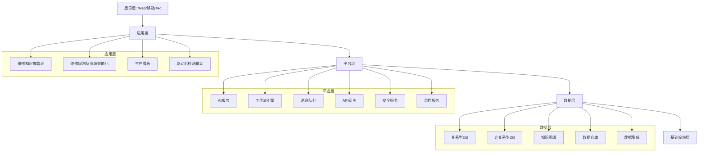
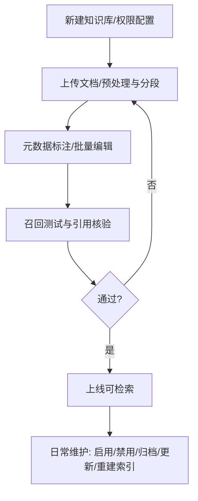
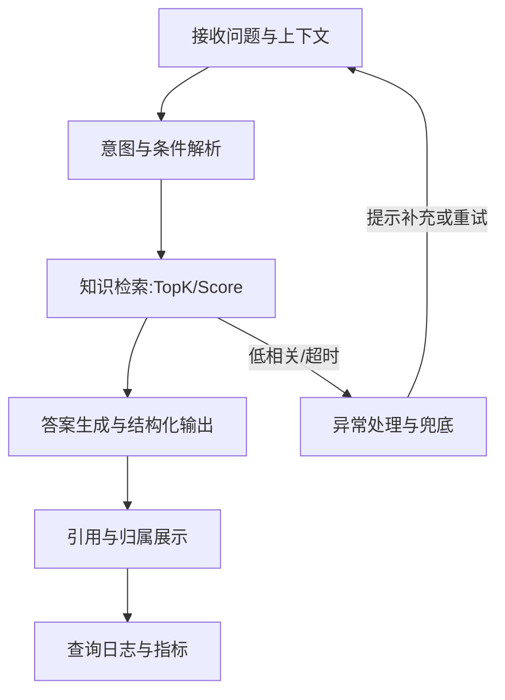
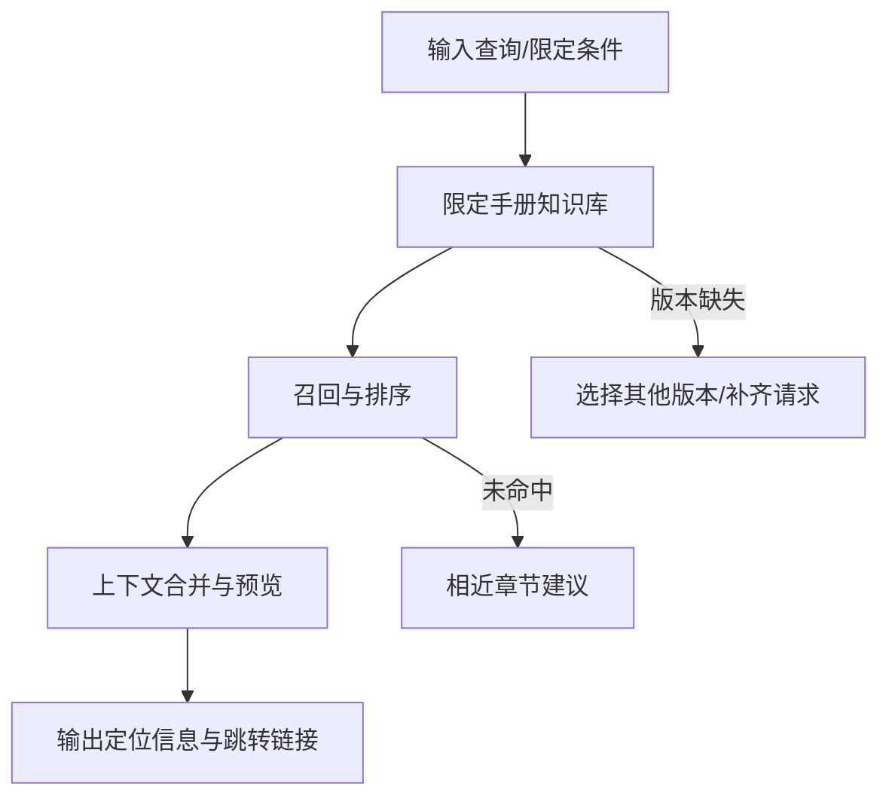
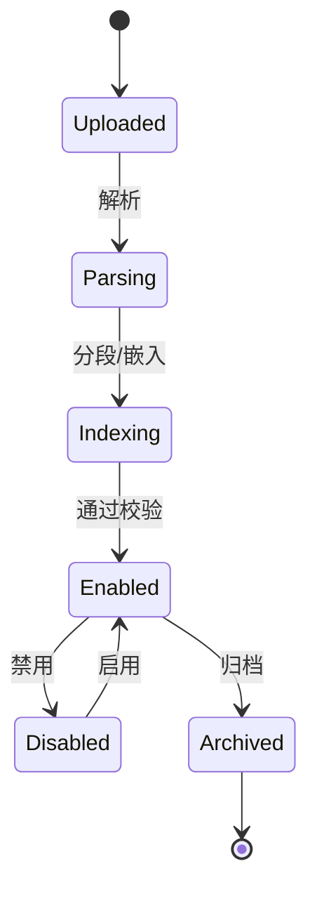
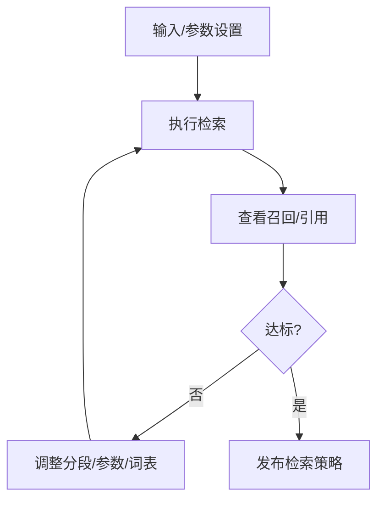
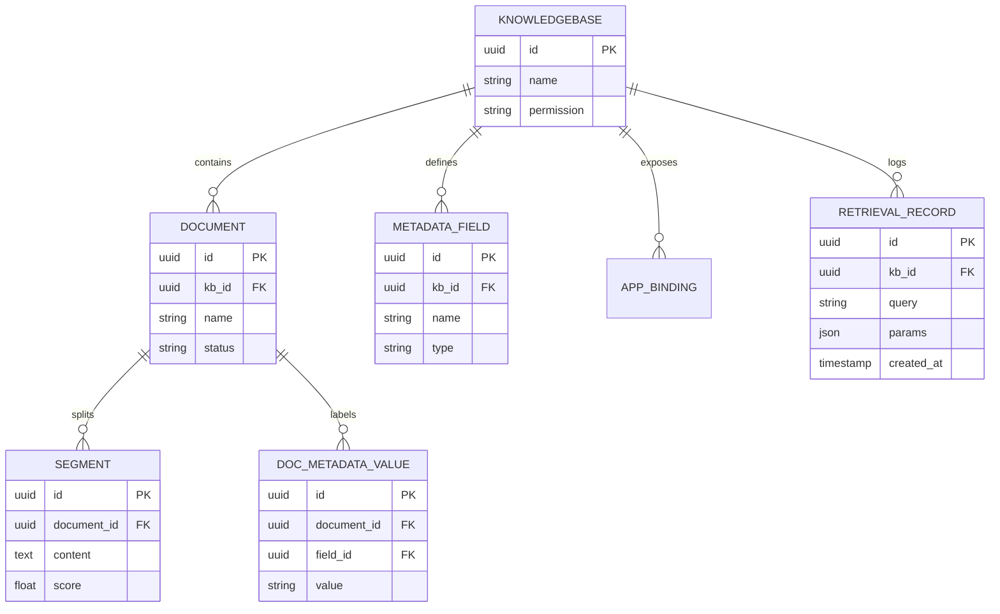

# 概要设计说明书

## 文档信息

| 文档版本 | 修订日期 | 修订人 | 修订描述 |
| ------- | ------- | ----- | ------- |
| v0.1    | YYYY-MM-DD | 待定 | 初稿 |

## 1. 引言

### 1.1 编写目的

本文档旨在描述飞机发动机QEC拆装智能化系统二期建设的概要设计方案，为系统的详细设计和实现提供指导。文档的预期读者包括项目管理人员、系统架构师、开发人员、测试人员以及相关业务部门负责人。

### 1.2 系统概述

飞机发动机QEC拆装智能化系统二期建设项目是在一期信息化系统基础上，通过引入人工智能技术，提高维修效率、优化资源配置，实现维修工作智能化管理的升级项目。系统主要包括维修知识库管理、维修规划及资源智能化、生产看板以及发动机检测辅助四大功能模块，旨在构建完善的维修知识体系，实现维修计划的智能生成与调整，优化资源配置，并提供多维度的生产状态可视化展示。

### 1.3 定义和缩略语

| 术语/缩略语 | 定义 |
| ---------- | --- |
| QEC | Quick Engine Change，快速发动机更换装置 |
| OEC | On-wing Engine Change，机翼发动机更换 |
| SAP | Systems Applications and Products，企业资源计划系统 |
| EO/EB/SB | Engineering Order/Engineering Bulletin/Service Bulletin，工程指令/工程通告/服务通告 |
| AI | Artificial Intelligence，人工智能 |
| NLP | Natural Language Processing，自然语言处理 |
| KG | Knowledge Graph，知识图谱 |
| API | Application Programming Interface，应用程序接口 |
| UI | User Interface，用户界面 |
| AR | Augmented Reality，增强现实 |

### 1.4 参考资料

1. 《飞机发动机QEC拆装智能化系统需求规格说明书》
2. 《飞机发动机QEC拆装业务流程文档》
3. 《机务维修AI辅助系统功能结构规划》
4. 《一期系统建设技术文档》
5. 《航空维修行业相关标准和规范》

## 2. 设计约束

### 2.1 硬件约束

1. 服务器性能：需要支持大规模数据处理和AI模型运行的高性能服务器
2. 终端设备兼容性：系统需支持PC、平板、AR眼镜等多种终端设备
3. 网络带宽：维修现场网络带宽可能不足，需考虑数据传输效率
4. 存储容量：维修知识库需要大容量存储设备支持

### 2.2 软件约束

1. 操作系统兼容性：需支持Windows/Linux/iOS/Android多种操作系统
2. 与现有系统集成：需与SAP、文档管理系统、人力资源系统等现有系统无缝集成
3. 安全性要求：系统需符合企业信息安全要求，支持多级权限控制和审计
4. 技术栈限制：需使用企业批准的技术栈进行开发

### 2.3 其他约束

1. 法规遵从：系统必须遵守航空维修行业相关法规和标准
2. 项目周期：项目开发周期不超过12个月
3. 团队规模：开发和运维团队规模有限
4. 预算限制：硬件投入预算有限

## 3. 系统架构

### 3.1 总体架构

系统采用分层架构，主要包括以下几层：

1. 基础设施层：提供计算、存储、网络等基础设施服务
2. 数据层：负责数据的存储、管理和处理
3. 平台层：提供共享服务和技术组件
4. 应用层：实现具体业务功能
5. 展示层：提供用户交互界面

系统架构图如下所示：




### 3.2 技术选型

| 技术领域 | 选择方案 | 选择理由 |
| ------- | ------- | ------- |
| 编程语言 | Python | 生态成熟，适合数据与 AI 开发 |
| Web 框架 | Flask | 与项目现状一致，成熟稳定，社区生态完善 |
| 前端框架 | Next.js | 与官方前端一致，支持 SSR/SSG，工程化能力强 |
| 数据库 | PostgreSQL | 事务与向量扩展能力强，社区与云原生支持完善 |
| 向量数据库 | Qdrant/Weaviate/Milvus/Pgvector 等 | 官方广泛适配，按需选型可替换 |
| LLM 推理引擎 | 项目推理运行时 | 稳定可靠、可扩展 |
| 商业模型支持 | 10+ 家 | 新主流模型通常 48 小时内完成接入 |
| MaaS 供应商 | Hugging Face、Replicate、AWS Bedrock、NVIDIA、GroqCloud、together.ai、OpenRouter | 供应商覆盖面广，灵活扩展 |
| 本地推理 Runtime | Xorbits、OpenLLM、LocalAI、ChatGLM、Ollama、NVIDIA TIS | 满足本地/离线部署需求 |
| 多模态能力 | ASR、GPT-4o 规格富文本 | 满足音频与富文本处理需求 |
| 部署方式 | Docker、Helm | 标准化交付与运维 |
| API 规格 | RESTful | 已覆盖大部分功能，便于集成 |
| 日志与标注 | 支持日志、标注与反馈 | 便于持续优化与治理 |

### 3.3 系统分层

1. **表示层**
   - 负责用户界面展示和交互
   - 包括Web界面、移动端界面和AR交互界面
   - 采用响应式设计，确保在不同设备上的一致体验

2. **应用层**
   - 实现核心业务逻辑
   - 包括维修知识库管理、维修规划及资源智能化、生产看板、发动机检测辅助四大功能模块
   - 采用领域驱动设计方法，保持业务逻辑的清晰和内聚

3. **服务层**
   - 提供共享服务和API接口
   - 包括AI服务、工作流服务、文件服务等
   - 采用微服务架构，确保服务的独立性和可重用性

4. **数据层**
   - 负责数据访问和持久化
   - 包括ORM映射、数据访问接口、缓存管理等
   - 支持多种数据存储方式，适应不同数据类型需求

5. **基础设施层**
   - 提供技术基础设施支持
   - 包括日志、监控、安全、通信等
   - 确保系统的稳定性、安全性和可维护性

## 4. 模块设计

### 4.1 模块划分

系统分为四个主要功能模块：

1. **维修知识库管理模块**
   - 负责维修知识的管理、检索和问答
   - 包括知识库构建、知识检索、智能问答等功能

2. **维修规划及资源智能化模块**
   - 负责维修计划的生成、调整和资源配置
   - 包括计划生成、计划调整、资源管理等功能

3. **生产看板模块**
   - 负责生产状态的可视化展示
   - 包括计划看板、进度看板、资源看板、工位看板等

4. **发动机检测辅助模块**
   - 负责辅助发动机检测工作
   - 包括检测任务管理、实时检测、报告生成等功能

### 4.2 模块关系

模块间的主要依赖关系如下：

1. 维修规划及资源智能化模块依赖维修知识库管理模块提供的知识支持
2. 生产看板模块依赖维修规划及资源智能化模块提供的计划和资源数据
3. 发动机检测辅助模块依赖维修知识库管理模块提供的检测知识
4. 所有模块都依赖共享的基础服务，如用户认证、权限管理等

模块关系图：


### 4.3 主要模块详述

#### 4.3.1 维修知识库管理模块

**功能职责**：
- 构建和维护维修知识库
- 提供智能化的知识检索和问答
- 支持维修需求的接收和处理

**主要子模块**：
1. 知识库构建子模块：负责维修手册、历史维修记录、维修经验和工程文件的接入与管理
2. 知识检索子模块：负责知识的索引建立和检索
3. 智能问答子模块：基于NLP和知识图谱技术，提供自然语言问答功能

**主要接口**：
- 知识录入接口：用于接入和更新维修知识
- 知识检索接口：支持关键词和语义检索
- 问答接口：支持自然语言问答

**依赖关系**：
- 依赖文档管理系统提供技术文档数据
- 依赖NLP和知识图谱服务提供语义理解能力

##### 4.3.1.1 知识库构建与维护设计
功能描述  
• 实现维修手册、历史维修记录、维修经验与结构化工程文件等多来源知识的接入、分段、标注、检索参数配置与全生命周期维护。

输入输出规范  
| 参数 | 类型 | 约束 | 示例 |
|---|---|---|---|
| datasetName | string | 非空、全局唯一 | "维修手册知识库" |
| permission | string | only_me / all / partial | "only_me" |
| file | file | 支持 TXT/MD/PDF/HTML/XLSX/DOCX/CSV 等 | handbooks.pdf |
| metadata | object | 字段类型仅限 string/number/time | {"device_model":"X100","manual_version":"v2.0"} |
| process_rule | object | 自定义/自动分段、预处理规则 | {"mode":"custom","rules":{...}} |

处理逻辑  
1. 新建知识库并设置权限范围。  
2. 上传文档（单/批），配置预处理与分段规则，触发解析与索引。  
3. 标注与批量编辑元数据字段；全局字段变更对全库生效。  
4. 召回测试与引用核验，按TopK/Score调参对比效果。  
5. 文档维护：启用/禁用/归档、更新与重建索引；分段新增/编辑/删除。  
→ 超限：进入队列并提示预计完成时间。  
→ 解析失败：转人工并生成问题清单。  
→ 名称冲突：提示重命名。

流程图  


接口定义（知识库管理，参考本项目文档“通过 API 维护知识库”）  
```http
POST /v1/datasets                       # 创建空知识库（body: name, permission）
GET  /v1/datasets?page=&limit=          # 知识库列表
DELETE /v1/datasets/{dataset_id}        # 删除知识库
POST /v1/datasets/{dataset_id}/document/create_by_file   # 通过文件创建文档（multipart）
POST /v1/datasets/{dataset_id}/document/create_by_text   # 通过文本创建文档（json）
POST /v1/datasets/{dataset_id}/documents/{document_id}/update_by_file  # 更新文档
POST /v1/datasets/{dataset_id}/documents/{document_id}/update_by_text  # 更新文档
GET  /v1/datasets/{dataset_id}/documents                         # 文档列表
DELETE /v1/datasets/{dataset_id}/documents/{document_id}         # 删除文档
GET  /v1/datasets/{dataset_id}/documents/{batch}/indexing-status # 嵌入进度
POST /v1/datasets/{dataset_id}/documents/{document_id}/segments  # 新增分段
GET  /v1/datasets/{dataset_id}/documents/{document_id}/segments  # 查询分段
DELETE /v1/datasets/{dataset_id}/documents/{document_id}/segments/{segment_id}  # 删除分段
POST /v1/datasets/{dataset_id}/documents/{document_id}/segments/{segment_id}   # 更新分段
POST /v1/datasets/{dataset_id}/metadata      # 新增元数据字段
PATCH /v1/datasets/{dataset_id}/metadata/{metadata_id}  # 更新元数据字段
DELETE /v1/datasets/{dataset_id}/metadata/{metadata_id} # 删除元数据字段
GET  /v1/datasets/{dataset_id}/metadata      # 元数据列表
```

错误与异常（节选）  
- 文件大小/类型不支持：file_too_large / unsupported_file_type。  
- 知识库未初始化：dataset_not_initialized。  
- 文档处理中不可编辑：document_indexing。  
- 名称冲突：dataset_name_duplicate。  
- 元数据不合法：invalid_metadata。

##### 4.3.1.2 自然语言智能问答设计
功能描述  
• 实现面向维修场景的自然语言问题解析与答案生成，结合内部维修知识库进行检索增强与引用追溯。

输入输出规范  
| 参数 | 类型 | 约束 | 示例 |
|---|---|---|---|
| question | string | 非空，长度≤2000 | "X100启动失败怎么处理？" |
| deviceModel | string? | 可选，存在于型号字典 | "X100" |
| manualVersion | string? | 可选，语义为版本号/修订号 | "v2.0" |
| timeRange | tuple<string,string>? | 可选，ISO8601时间范围 | ["2024-10-01","2024-12-31"] |
| attachments | string[]? | 可选，指向已上传文件ID | ["file_abc123"] |

处理逻辑  
1. 解析意图与约束（型号/版本/时间）并构造检索条件。  
2. 依据检索条件在知识库执行多路召回（控制参考段落TopK与相关度阈值）。  
3. 汇总召回片段并进行答案生成，产出结构化结果（答案、关键步骤、引用来源、置信度）。  
4. 输出引用与归属，可跳转至知识分段详情以便核验与修订。  
5. 记录查询日志与指标（响应时间、召回数量、点击率）。  
→ 相关度过低：触发重试策略（放宽阈值或改写问题），仍不足则提示补充信息。  
→ 检索超时：中止检索并返回“请稍后重试”，记录告警。

流程图  


接口对接说明（复用对话型应用 API）  
```http
POST /v1/chat-messages                  # 发送问题（query），可携带 inputs 与 files
POST /v1/chat-messages/:task_id/stop    # 停止流式响应
POST /v1/files/upload                   # 上传附件（日志/图片/表格）
GET  /v1/messages                       # 历史消息（含 retriever_resources 引用）
GET  /v1/conversations                  # 会话列表
POST /v1/messages/:message_id/feedbacks # 点赞/点踩
```
参数映射  
- question → query  
- deviceModel/manualVersion/timeRange 等 → inputs 内的业务变量  
- attachments → files（支持 image/audio/video/document，或使用 POST /v1/files/upload 先传后用）  
- 引用与归属 → 消息返回中的 retriever_resources 字段  
错误与超时处理 → 参考对话型应用 API 错误码规范（如 invalid_param、app_unavailable、completion_request_error 等）

##### 4.3.1.3 维修手册检索与定位设计
功能描述  
• 实现“按手册定位”的精准检索与跳转，输出章节/页码/段落定位与上下文预览，支持版本切换与比对。

输入输出规范  
| 参数 | 类型 | 约束 | 示例 |
|---|---|---|---|
| query | string | 非空，长度≤2000 | "如何复位燃油控制单元？" |
| deviceModel | string? | 可选 | "X100" |
| manualVersion | string? | 可选 | "v2.0" |

处理逻辑  
1. 识别定位意图并限定知识库为“维修手册”。  
2. 按相关度排序召回分段，合并上下文以展示完整语境。  
3. 输出手册名称、章节/页码/段落号、相关度评分与预览。  
4. 提供跳转到分段详情的定位链接，支持版本切换与对比。  
→ 未命中：返回相近章节建议与关键词提示。  
→ 版本缺失：允许选择其他有效版本或提交补齐请求。

流程图  


接口对接说明（复用对话型应用 API）  
```http
POST /v1/chat-messages                  # 发送问题（query），通过 inputs 限定 deviceModel/manualVersion
GET  /v1/messages                       # 历史消息（含 retriever_resources 引用与定位）
```
参数映射  
- query → query  
- deviceModel/manualVersion → inputs  
- 定位信息 → retriever_resources 中的文档名与分段定位（章节/页码/段落）  
错误与超时处理 → 参考对话型应用 API 错误码规范

##### 4.3.1.4 元数据管理设计
功能描述  
• 管理知识库全局与文档级元数据，支撑按来源/型号/版本/时间/标签等维度筛选与可追溯引用。

输入输出规范  
| 参数 | 类型 | 约束 | 示例 |
|---|---|---|---|
| field.name | string | 小写字母/数字/下划线，唯一 | "device_model" |
| field.type | enum | string/number/time | "string" |
| built_in.enabled | bool | 只读字段启用/禁用 | true |
| doc.metadata | object | 仅使用已定义字段；多值允许 | {"tags":["润滑","振动"]} |
| apply_all | bool | 批量修改是否应用于所有选中文档 | false |

处理逻辑  
1. 字段增删改：新增字段→全库可用；重命名同步全库；删除字段将从全库移除字段与值。  
2. 文档标注：支持批量与单文档标注、重置与删除；可选“应用于所有文档”。  
3. 内置字段：文件名、上传者、上传日期、最后更新时间、来源（可启用）。  
→ 校验失败：提示字段名/类型不合法。  
→ 删除确认：高风险操作需二次确认与审计记录。

接口定义（节选）  
```http
POST  /v1/datasets/{dataset_id}/metadata                     # 新增元数据字段
PATCH /v1/datasets/{dataset_id}/metadata/{metadata_id}       # 更新字段
DELETE /v1/datasets/{dataset_id}/metadata/{metadata_id}      # 删除字段
GET   /v1/datasets/{dataset_id}/metadata                     # 获取字段列表
POST  /v1/datasets/{dataset_id}/documents/metadata           # 批量赋值文档元数据
```

##### 4.3.1.5 文档与分段维护设计
功能描述  
• 支持文档启用/禁用/归档、更新与重建索引；支持分段新增/编辑/删除与批量导入，保障召回质量可控。

输入输出规范  
| 操作 | 输入 | 输出 | 约束 |
|---|---|---|---|
| 启用/禁用 | document_id | 状态变更 | 禁用不参与检索 |
| 归档/撤销 | document_id | 状态变更 | 归档仅可读不可编辑 |
| 更新文档 | file/text | 新版内容 | 触发重建索引 |
| 新增分段 | segments[] | 分段记录 | 支持CSV批量模板 |
| 编辑/删除分段 | segment_id | 状态/内容变更 | 关键变更需审计 |

处理逻辑  
1. 文档状态：启用→参与检索；禁用/归档→不参与检索。  
2. 更新触发解析/分段/嵌入进度；失败可重试或回滚。  
3. 分段维护支持关键词与内容编辑，重要变更需留痕。  
→ 文档处理中不可编辑：提示稍后重试。  
→ 归档不可编辑：拒绝并提示。

接口定义（节选）  
```http
POST  /v1/datasets/{dataset_id}/document/create_by_file
POST  /v1/datasets/{dataset_id}/document/create_by_text
POST  /v1/datasets/{dataset_id}/documents/{document_id}/update_by_file
POST  /v1/datasets/{dataset_id}/documents/{document_id}/update_by_text
GET   /v1/datasets/{dataset_id}/documents/{document_id}/segments
POST  /v1/datasets/{dataset_id}/documents/{document_id}/segments
POST  /v1/datasets/{dataset_id}/documents/{document_id}/segments/{segment_id}
DELETE/… segments/{segment_id}
```

状态机  


##### 4.3.1.6 检索参数配置与调试/引用归属设计
功能描述  
• 提供召回测试台，支持检索策略/TopK/Score调参对比，并展示引用与归属便于核验与修订。

输入输出规范  
| 参数 | 类型 | 约束 | 示例 |
|---|---|---|---|
| query | string | 非空 | "E05风扇故障" |
| topK | int | 1~50 | 8 |
| score_threshold | float | 0~1 | 0.3 |
| filters | object | 元数据筛选 | {"device_model":"X100"} |

处理逻辑  
1. 输入问题→执行检索→输出召回分段（含分数/引用）。  
2. 支持不同参数保存并行对比，便于选择上线策略。  
3. 历史记录可查询，便于回溯调优。  
→ 召回过少：提示放宽阈值或扩展关键词。  
→ 质量不达标：阻断上线并要求修订分段或词表。

流程图  


##### 4.3.1.7 请求频率限制设计
功能描述  
• 对知识库关键操作设置每分钟请求上限，防止滥用并保障稳定性。

约束与策略  
- 受限操作：创建/删除知识库、更新设置、上传/删除/更新文档、启用/禁用/归档、暂停/恢复处理、分段增删改、召回测试、应用内查询等。  
- 超限行为：返回限流提示，1分钟内暂缓执行；记录告警与审计。  
- 配置：按环境与用户组可调（默认按工作区级别）。

##### 4.3.1.8 工作流集成与编排设计
功能描述  
• 将知识检索节点与生成节点编排为问答流程，支持变量注入与文件上传，输出结构化答案与引用。

输入输出规范  
| 参数 | 类型 | 约束 | 示例 |
|---|---|---|---|
| query | string | 非空 | "X100启动失败怎么处理？" |
| variables | object | 业务变量表单 | {"device_model":"X100"} |
| files | array | 可选，受限于文件大小/类型 | 上传文件ID |

处理逻辑  
1. 触发编排流程：接收输入→检索节点→生成节点→结构化输出→引用展示。  
2. 支持节点级错误捕获与重试（参考可视化编排的错误处理能力）。  
3. 支持对话会话持久化与变量管理。

接口定义（对话型应用，节选）  
```http
POST /v1/chat-messages                  # 发送消息（streaming/blocking）
POST /v1/chat-messages/:task_id/stop    # 停止流式响应
POST /v1/files/upload                   # 文件上传
GET  /v1/messages                       # 获取会话历史
GET  /v1/conversations                  # 获取会话列表
POST /v1/messages/:message_id/feedbacks # 点赞/点踩
```

##### 4.3.1.9 数据模型概览（模块内）
ER关系（简化）  


##### 4.3.1.10 来源型知识库实例设计
功能描述  
• 针对不同来源类型分别建立知识库，使用差异化元数据与检索策略管理，确保分离治理与统一检索。

实例与约束  
| 实例 | 必填元数据 | 可选元数据 | 版本/生效策略 | 默认检索范围 |
|---|---|---|---|---|
| 维修手册知识库 | device_model, manual_version, effective_date | language, section | 同型号版本并存，默认仅“生效中” | 最新有效版本 |
| 历史维修记录知识库 | work_order_id, device_model, repair_date | fault_code, solution, technician | 同工单以时间近者覆盖 | 最近N月（可配） |
| 维修经验知识库 | topic, applicable_models, last_review_date | tags(多值), risk_level, owner | 超6个月未评审需复审 | 全量，但高风险需确认 |
| 结构化工程知识库 | part_no, revision, effective_date | bom_id, process_phase, supplier | 同部件版本并存，记录差异 | 最新有效版本 |

处理逻辑  
1. 每类来源独立知识库与字段规范；全局元数据字段库统一治理。  
2. 上线前进行召回测试与引用核验，覆盖典型用例集。  
3. 运行期按策略自动筛选默认检索范围（例如最新有效/最近N月）。  
→ 必填元数据缺失：阻断上线并提示。  
→ 同名冲突：提示重命名或合并策略。

##### 4.3.1.11 维修知识库关键词与数据索引设计
功能描述  
• 建立关键词体系（核心词/同义词/禁用词）与多维索引（来源/型号/版本/时间/标签），支撑高质量召回与可解释引用。

配置项  
| 配置 | 内容 | 约束 |
|---|---|---|
| 词表 | core_terms, synonyms[], stopwords[] | 需评审与版本化 |
| 索引维度 | source_type, device_model, version, effective_date, tags | 映射至元数据字段 |
| 策略参数 | topK, score_threshold | 不同场景可预设与切换 |

处理逻辑  
1. 词表治理流程：提案→评审→发布→生效→回滚。  
2. 索引构建：支持增量/全量重建；变更触发质量门禁。  
3. 验收：以测试用例集核验召回率/准确率，未达标阻断发布。  
→ 词表冲突：给出合并建议。  
→ 质量回退：自动回滚至上一版本并告警。

##### 4.3.1.12 权限与审计设计
功能描述  
• 基于角色控制知识库与文档操作权限，关键操作留痕，满足合规要求。

权限矩阵（节选）  
| 角色 | 知识库可见性 | 字段管理 | 文档上传/更新 | 启用/禁用/归档 | 索引重建 | 调试/测试 |
|---|---|---|---|---|---|---|
| 所有者 | 全部 | 允许 | 允许 | 允许 | 允许 | 允许 |
| 管理员 | 指定范围 | 允许 | 允许 | 允许 | 允许 | 允许 |
| 编辑 | 指定范围 | 受限 | 允许 | 受限 | 受限 | 允许 |
| 只读 | 指定范围 | 否 | 否 | 否 | 否 | 允许（只读） |

审计与留痕  
- 记录范围：字段增删改、批量赋值、文档启用/禁用/归档、分段新增/编辑/删除、索引重建、检索策略发布、词表变更。  
- 内容包含：操作人、时间、对象、差异、原因与备注。  
- 保留期限：≥12个月；支持导出与稽核查询。

##### 4.3.1.13 外部知识库接入与管理设计
功能描述  
• 通过标准化检索 API 接入外部知识库，作为内部知识的补充数据源，实现统一召回、重排与引用展示，避免跨系统内容搬运。

架构与组件  
- 配置管理：保存外部端点、认证凭据、外部库 ID、默认 TopK/Score/过滤器；
- 连接器（Connector）：封装 HTTP/鉴权/超时/重试；
- 标准化适配层：将外部返回转换为统一的分段结构（content、source_ref、score、locators）；
- 合并与重排器：与内部候选集合并去重并按策略重排；
- 监控告警：可用率、超时率、配额余量、错误码趋势。

交互流程  
1) 读取外部连接配置→2) 发起检索请求→3) 解析并标准化→4) 与内部结果合并重排→5) 返回统一引用。  
失败时降级为内部检索，并记录事件与指标。

关键参数  
- endpoint、credential、external_kb_id、top_k、score_threshold、filters。

输入输出规范  
| 参数 | 类型 | 约束 | 示例 |
|---|---|---|---|
| externalKbId | string | 可选 | "kb-ext-01" |
| query | string | 非空，≤2000 | "燃油泄漏排查" |
| maxSegments | int | 1~50 | 8 |
| minRelevance | float | 0~1 | 0.5 |

接口定义  
```http
POST /kb/external/search
body: { query, externalKbId?, maxSegments?, minRelevance? }
errors: 401 unauthorized, 408 timeout, 422 invalid_param
```

##### 4.3.1.14 检索方式与重排策略设计
功能描述  
• 提供向量/关键词/混合检索与父子分段上下文合并，多阶段重排（规则/模型）提升命中质量、覆盖与可解释性。

策略要点  
- 初检索：内部与外部数据源并行召回；
- 上下文合并：对子分段命中合并父分段上下文；
- 重排：去冗与多样性（近似合并/同源覆盖率控制）、重要性提升（标题/关键词/字段权重）、基于相关度的 MMR 思路；
- 终排：输出 TopK 与引用信息（文档、章节/页码/段落、分数）。

配置与范围  
- 知识库级默认策略与应用级覆盖策略并存；
- 可保存多版本策略用于 A/B 与灰度发布。

输入输出规范  
| 参数 | 类型 | 约束 | 示例 |
|---|---|---|---|
| mode | enum | vector/keyword/hybrid | "hybrid" |
| parentMerge | bool | 默认true | true |
| maxPerDoc | int | 1~10 | 3 |

接口定义  
```http
POST /kb/retrieval/preview
body: { query, mode, parentMerge?, maxPerDoc? }
errors: 422 invalid_param, 500 internal_error
```

##### 4.3.1.15 检索质量监控与治理设计
功能描述  
• 提供召回测试台、用例集校验、指标看板与发布门禁，支持策略版本化与快速回滚。

指标与观测  
- 召回命中率、平均分、引用点击率、用户反馈；
- 时延（P50/P95）、超时率、外部连接可用率；
- A/B 对比增益与显著性。

流程  
1) 汇集应用检索日志→2) 维护测试用例集→3) 测试台调参与对比→4) 生成报告与门禁→5) 发布/回滚与审计。

门禁与治理  
- 未达标阻断发布；
- 词表与策略变更纳入审计；
- 支持一键回滚。

输入输出规范  
| 参数 | 类型 | 约束 | 示例 |
|---|---|---|---|
| testcaseSetId | string | 可选 | "tc-2025w10" |
| gateMinRecall | float | 0~1 | 0.6 |
| abWindowDays | int | 1~30 | 7 |

接口定义  
```http
POST /kb/quality/eval
body: { testcaseSetId, gateMinRecall, abWindowDays }
errors: 409 gate_not_met, 422 invalid_param
```

#### 4.3.2 维修规划及资源智能化模块

**功能职责**：
- 智能生成和调整维修计划
- 优化航材、人员和工具等资源配置
- 处理工作协同冲突

**主要子模块**：
1. 计划管理子模块：负责维修计划的生成、流程管理和调整
2. 航材管理子模块：负责航材规划和资源保障
3. 人员管理子模块：负责人员调度和技能匹配
4. 工具管理子模块：负责工具配置和使用优化

**主要接口**：
- 计划生成接口：根据维修指令智能生成计划
- 计划调整接口：支持计划的动态调整
- 资源配置接口：提供资源的智能配置服务

**依赖关系**：
- 依赖SAP系统提供维修指令和基础数据
- 依赖维修知识库提供专业知识支持
- 依赖工作流引擎实现流程控制

#### 4.3.3 生产看板模块

**功能职责**：
- 提供多维度的生产状态可视化展示
- 支持实时监控维修计划执行情况
- 展示资源使用状态

**主要子模块**：
1. 计划看板子模块：展示近期、中期和长期计划
2. 进度看板子模块：显示维修任务执行进度
3. 资源看板子模块：展示航材、人员、工具等资源状态
4. 工位看板子模块：显示工位使用情况

**主要接口**：
- 数据获取接口：从维修规划模块获取计划和进度数据
- 看板展示接口：提供不同维度的看板视图
- 实时更新接口：支持数据的实时刷新

**依赖关系**：
- 依赖维修规划及资源智能化模块提供基础数据
- 依赖实时数据处理服务提供数据流处理

#### 4.3.4 发动机检测辅助模块

**功能职责**：
- 管理发动机检测任务
- 辅助检测过程，提高效率和准确性
- 生成检测报告和分析结果

**主要子模块**：
1. 检测任务管理子模块：负责创建和管理检测任务
2. 检测执行子模块：支持检测过程的实施
3. 结果分析子模块：分析检测数据，生成报告
4. 预警管理子模块：根据检测结果提供预警信息

**主要接口**：
- 任务创建接口：支持检测任务的创建和配置
- 数据采集接口：连接检测设备，收集检测数据
- 报告生成接口：基于检测数据生成分析报告

**依赖关系**：
- 依赖检测设备提供原始数据
- 依赖维修知识库提供检测标准和规范
- 依赖AI分析服务提供智能数据分析能力

## 5. 数据设计

### 5.1 维修知识库管理模块

#### 5.1.1 数据模型

结合项目知识库设计与维修业务需求，定义如下核心实体与关系（不依赖外部文档即可理解）：

- 知识库 Dataset（维修知识库）
  - 字段要点：id、name、description、permission(only_me/all/partial)、indexing_technique(high_quality/economy)、embedding_model、retrieval_model、provider(vendor/external)、external_knowledge_id?
  - 说明：承载某类来源的维修知识（维修手册/历史维修记录/经验/工程文件）。
- 文档 Document（来源文档）
  - 字段要点：id、dataset_id、name、status(uploaded/parsing/indexing/enabled/disabled/archived)、source(uri/hash)、doc_form(text_model/hierarchical_model/qa_model)
  - 说明：与文件存储/对象存储绑定，受解析与索引状态机管理。
- 分段 Segment（父分段）/ 子分段 ChildChunk
  - 字段要点：id、document_id、content、answer?、keywords[]?、score、enabled
  - 说明：支持父子分段（Parent-Child）以提升定位与上下文能力。
- 元数据定义 MetadataField / 文档元数据值 DocMetadataValue
  - 字段要点：field(name,type:string|number|time,built_in.enabled)、value
  - 维修域推荐字段：device_model、manual_version、effective_date、work_order_id、fault_code、risk_level、tags。
- 召回记录 RetrievalRecord（用于质量治理与追溯）
  - 字段要点：kb_id、query、params(topK/threshold/filters/strategy 等)、created_at。
- 应用绑定 AppBinding（知识库与应用绑定关系）
  - 字段要点：app_id、dataset_id、strategy_version、citation_enabled。
- 外部连接 ExternalConnector（可选）
  - 字段要点：endpoint、credential、安全策略、默认 top_k/score_threshold/filters。

关系概览：
- 一个 Dataset 下有多 Document；每个 Document 拆分为若干 Segment/ChildChunk；Dataset 定义可被 App 绑定；检索调用产生 RetrievalRecord；MetadataField 作用域为 Dataset，DocMetadataValue 绑定到 Document。

#### 5.1.2 数据库与存储设计

- 关系型数据库（PostgreSQL）
  - 存储：Dataset、Document、Segment/ChildChunk 元数据、元数据模型、检索与操作日志等。
  - 索引建议：
    - document(dataset_id, status)、segment(document_id, enabled)
    - 元数据值(field_id, value)、常用过滤字段（device_model、manual_version、effective_date、tags）
    - 审计/日志表(created_at) 时间分区或时间索引
- 向量数据库（可插拔）：可选 Weaviate / Qdrant / Milvus / Pgvector / Elasticsearch 等，按环境与规模选型
  - 存储：分段的 embedding 向量及倒排索引（economy 模式）
  - 设计：
    - 每 Dataset 一个 collection/namespace，分区按 workspace/tenant 隔离
    - 字段：vector、segment_id、document_id、dataset_id、metadata（device_model、manual_version、tags…）
    - 支持 Hybrid（向量+关键词）、Rerank 以及父子分段上下文合并
- 对象存储（本地卷/S3 兼容/OSS 等）
  - 存储：原始文件、解析中间产物（按需）
- 缓存/队列
  - Redis：短期缓存、任务队列标记与去重；
  - 后台 Worker：文档解析与索引任务（参考 api/tasks/*）。

#### 5.1.3 数据流

1) 知识接入/索引构建（ETL + 索引）
- 新建 Dataset → 上传文件/文本 → 选择分段与清洗规则（automatic/custom）与 doc_form
- 触发后台解析与分段 → 生成父/子分段 → 执行 embedding 或倒排索引构建
- 设置元数据字段并批量标注 → 召回测试与引用核验达标 → 文档/知识库启用

2) 查询与问答（RAG）
- 接收问题与业务上下文 → 构造检索条件（filters：device_model/manual_version/timeRange…）
- 选定模式（semantic/full_text/hybrid）并行多库召回 → 去冗与重排（Rerank/MMR/权重）
- 合并父子上下文 → 交由 LLM 生成答案 → 输出答案+引用 → 记录检索日志与指标

3) 维护与治理
- 文档启用/禁用/归档、更新与重建索引；分段新增/编辑/删除
- 元数据字段增删改与批量赋值；检索策略版本化、A/B、门禁与回滚
- 外部知识库联邦检索：失败自动降级、配额/超时监控

### 5.2 维修规划及资源智能化模块（预留）

#### 5.2.1 数据模型
（预留）

#### 5.2.2 数据库与存储设计
（预留）

#### 5.2.3 数据流
（预留）

### 5.3 生产看板模块（预留）

#### 5.3.1 数据模型
（预留）

#### 5.3.2 数据库与存储设计
（预留）

#### 5.3.3 数据流
（预留）

### 5.4 发动机检测辅助模块（预留）

#### 5.4.1 数据模型
（预留）

#### 5.4.2 数据库与存储设计
（预留）

#### 5.4.3 数据流
（预留）

## 6. 接口设计

### 6.1 维修知识库管理模块

#### 6.1.1 外部接口（对应用/第三方）

本模块对外提供与复用以下接口规范。读者无需依赖外部文档即可理解和集成：

- 认证：Bearer API-Key（建议服务端保存），工作区/租户隔离。
- 知识库管理
  - POST /v1/datasets                     创建空知识库（name, permission, indexing_technique, embedding_model, retrieval_model, provider, external_knowledge_id?）
  - GET  /v1/datasets?page=&limit=&keyword=   列表/检索知识库
  - GET  /v1/datasets/{dataset_id}         查看详情
  - PATCH /v1/datasets/{dataset_id}        更新（permission/indexing/retrieval/embedding/partial_members…）
  - DELETE /v1/datasets/{dataset_id}       删除
- 文档管理
  - POST /v1/datasets/{dataset_id}/document/create-by-file   通过文件创建文档（multipart data+process_rule）
  - POST /v1/datasets/{dataset_id}/document/create-by-text   通过文本创建文档
  - POST /v1/datasets/{dataset_id}/documents/{document_id}/update-by-file  更新文档（触发重建索引）
  - POST /v1/datasets/{dataset_id}/documents/{document_id}/update-by-text  更新文档
  - GET  /v1/datasets/{dataset_id}/documents                    文档列表
  - DELETE /v1/datasets/{dataset_id}/documents/{document_id}    删除文档
  - GET  /v1/datasets/{dataset_id}/documents/{batch}/indexing-status  嵌入进度
- 分段与子分段
  - POST   /v1/datasets/{dataset_id}/documents/{document_id}/segments  新增分段（content/answer?/keywords[]?）
  - GET    /v1/datasets/{dataset_id}/documents/{document_id}/segments  查询分段（keyword/status/page/limit）
  - POST   /v1/datasets/{dataset_id}/documents/{document_id}/segments/{segment_id} 更新分段（enabled/keywords/regen_child_chunks）
  - DELETE /v1/datasets/{dataset_id}/documents/{document_id}/segments/{segment_id} 删除分段
  - POST   /v1/datasets/{dataset_id}/documents/{document_id}/segments/{segment_id}/child_chunks       新增子分段
  - GET    /v1/datasets/{dataset_id}/documents/{document_id}/segments/{segment_id}/child_chunks       查询子分段
  - PATCH  /v1/datasets/{dataset_id}/documents/{document_id}/segments/{segment_id}/child_chunks/{child_chunk_id} 更新子分段
  - DELETE /v1/datasets/{dataset_id}/documents/{document_id}/segments/{segment_id}/child_chunks/{child_chunk_id} 删除子分段
- 元数据
  - POST  /v1/datasets/{dataset_id}/metadata                     新增元数据字段（type/name）
  - PATCH /v1/datasets/{dataset_id}/metadata/{metadata_id}       更新
  - DELETE /v1/datasets/{dataset_id}/metadata/{metadata_id}      删除
  - GET   /v1/datasets/{dataset_id}/metadata                     列表
  - POST  /v1/datasets/{dataset_id}/documents/metadata           批量赋值文档元数据
- 检索与调试
  - POST /v1/datasets/{dataset_id}/retrieve                       按检索模型参数执行检索（hybrid/semantic/full_text、rerank、top_k、score_threshold）
  - 对话型应用复用：POST /v1/chat-messages（query, inputs, files），GET /v1/messages（含 retriever_resources 引用）
- 外部知识库（可选）
  - POST /kb/external/search                                      统一检索外部 KB，标准化返回并重排（endpoint/credential 配置在服务端）

错误码对齐：file_too_large / unsupported_file_type / dataset_not_initialized / document_indexing / dataset_name_duplicate / invalid_metadata 等。

#### 6.1.2 内部接口（模块间）

- 工作流引擎 → 知识检索节点：入参 {query, variables(inputs), files?}，出参 {segments[], citations[], metrics}
- 规划模块 → 知识库：按 device_model/manual_version 过滤检索维修策略与标准作业书（SOP）
- 检测辅助模块 → 知识库：按 fault_code/part_no 召回检测规范与排故步骤
- 安全/审计服务：记录知识库关键变更与检索策略发布日志
- 监控服务：采集召回率、P95 时延、超时率、外部连接可用率

#### 6.1.3 用户接口（UI 交互要点）

- 创建知识库/上传文档向导：导入数据 → 文本清洗/分段 → 索引与检索设置 → 进度与上线
- 文档/分段管理：启用/禁用/归档、批量分段导入与编辑、分段详情与定位（章节/页码/段落）
- 召回测试台与引用归属：TopK/Score 调参与版本对比、引用源一键跳转
- 元数据管理：字段库治理、批量赋值、诊断缺失必填项
- 权限与审计：按角色控制可见与编辑范围、操作留痕与导出审计

### 6.2 维修规划及资源智能化模块（预留）

#### 6.2.1 外部接口
（预留）

#### 6.2.2 内部接口
（预留）

#### 6.2.3 用户接口
（预留）

### 6.3 生产看板模块（预留）

#### 6.3.1 外部接口
（预留）

#### 6.3.2 内部接口
（预留）

#### 6.3.3 用户接口
（预留）

### 6.4 发动机检测辅助模块（预留）

#### 6.4.1 外部接口
（预留）

#### 6.4.2 内部接口
（预留）

#### 6.4.3 用户接口
（预留）

## 7. 安全设计

### 7.1 维修知识库管理模块

#### 7.1.1 安全总则

结合本项目权限模型与企业安全要求，结合维修合规特性，制定如下安全设计：

##### 7.1.2 身份认证与鉴权
- 采用工作区/租户级隔离与 API-Key 鉴权；后台服务端保存密钥，前端不直传。
- 支持 SSO（如 OIDC/SAML）对接企业统一身份；会话管理与令牌最小权限原则（Least Privilege）。

##### 7.1.3 授权与权限矩阵
- 角色：所有者/管理员/编辑/只读；
- 范围：知识库可见性（only_me/all/partial）、字段管理、文档上传更新、启用/禁用/归档、索引重建、调试测试；
- 细粒度：到 Dataset/Document/Segment 层级；部分成员列表 partial_members 受控。

##### 7.1.4 数据保护
- 传输安全：HTTPS、内部服务使用内网或 mTLS；
- 存储安全：对象存储与数据库开启加密；向量库元数据避免存放敏感明文；
- 脱敏与最小化：对工单号/人员姓名等按需脱敏；仅存放检索所需最小信息；
- 备份与恢复：数据库/对象存储/向量库定期备份，演练恢复；
- 数据生命周期：归档文档只读不可编辑；过期版本可按策略清理，保留检索引用可追溯。

##### 7.1.5 审计与合规
- 审计范围：字段增删改、批量赋值、文档启用/禁用/归档、分段增删改、索引重建、检索策略发布、词表变更；
- 审计内容：操作者、时间、对象、差异、原因与备注；
- 保留期限：≥12 个月，支持导出用于稽核。

##### 7.1.6 速率限制与防滥用
- 请求频率限制：创建/删除知识库、上传/删除/更新文档、增删改分段、召回测试、查询接口等按分钟/用户组限流；
- 超限响应：返回限流提示并记录告警；
- 防刷与防注入：文件类型白名单、大小限制、解析沙箱隔离；文本清洗防脚本与恶意 payload；
- 外部连接保护：外部检索设置配额/超时/重试与熔断，失败自动降级到内部检索。

##### 7.1.7 机密与密钥管理
- 外部知识库连接凭据集中保管（KMS/密钥库），按角色访问；
- 环境变量与配置文件不含明文密钥，统一密管；
- 定期轮换与吊销策略。

## 8. 性能设计

### 8.1 维修知识库管理模块

#### 8.1.1 性能目标
- 检索时延：P50 ≤ 800ms，P95 ≤ 2s（不含 LLM 生成时延）；
- 构建吞吐：索引构建支持并发文档≥10（按资源可配）；
- 可用性：核心检索路径可用率 ≥ 99.9%。

##### 8.1.2 性能策略
- 检索路径
  - 采用 Hybrid 检索（向量+关键词）与可选 Rerank，父子分段上下文合并减少无效召回；
  - TopK/Score 自适应：根据历史点击/反馈调整；低相关重试策略（扩大召回或改写查询）；
  - 命中去重与 MMR 多样性，限制单文档最大返回段数；
  - 结果缓存：对热问题启用短期缓存（键含 query+filters+strategy_version）。
- 索引路径
  - 文档解析与嵌入走异步队列，分批提交向量库；失败重试与断点续传；
  - 向量库分库/分命名空间隔离，避免大库互相拖慢；
  - 增量索引：文档更新仅重建受影响段落。
- 资源与扩展
  - 多副本/多实例：api 与 worker 横向扩展；向量库按需扩容；
  - 负载均衡：Nginx/Ingress；
  - 模型推理：Embedding 与 Rerank 模型并发池，必要时本地化（Ollama/本地推理）。

##### 8.1.3 监控与容量规划
- 指标：召回命中率、平均分、引用点击率、用户反馈；P50/P95 时延、超时率；外部连接可用率与配额；
- 日志：检索查询与召回明细、错误码统计；
- 容量：按知识库量、文档量、平均段落数、嵌入维度与 TopK 推估向量规模与 IOPS，制定扩容阈值。

## 9. 部署设计

### 9.1 维修知识库管理模块

#### 9.1.1 方案概述

采用容器化部署方案，结合企业内网与多环境实践，给出如下部署方案：

#### 9.1.2 组件拓扑
- 核心服务：api、worker、web
- 依赖组件：PostgreSQL、Redis、向量数据库（Weaviate/Qdrant/Milvus/Pgvector/Elasticsearch）、Nginx、SSRF Proxy、Sandbox（安全沙箱）
- 对象存储：兼容 S3/OSS/本地卷
- 外部模型与 Rerank/MaaS：可通过环境变量配置供应商与 API Key（如 OpenAI、Bedrock、NVIDIA、Ollama 本地等）

#### 9.1.3 环境与资源建议
- 单机 PoC：CPU≥2C、RAM≥8GiB；生产建议 ≥ 4C/16GiB，向量库按规模独立节点；
- 容器化：按 docker/.env.example 配置，区分 DEV/UAT/PROD；
- 网络：各容器同网段，限制仅暴露 Nginx/必要端口；数据库与向量库仅内网访问。

#### 9.1.4 配置要点
- 环境文件同步：以 .env 为准，新增项与变更项需与模板同步；可按需启用 Unstructured ETL 或内置 ETL；
- 存储：对象存储桶/路径分租户隔离；数据库与向量库持久化卷；
- 模型与检索：设置默认 embedding_model、retrieval 默认（hybrid/semantic/full_text）、启用 Rerank 与参数；
- 安全：开启 HTTPS/证书；Sandbox 打开以隔离解析执行；SSRF 代理启用避免内网穿透风险；
- 外部知识库连接：在服务端配置 endpoint/credential 与配额、超时、熔断策略。

#### 9.1.5 部署步骤（Compose 示例）
1) 进入 docker 目录并复制环境文件
- cp .env.example .env
2) 启动容器
- docker compose up -d
3) 初始化与访问
- 安装初始化页 http://localhost/install，设置管理员账号
- Web 地址 http://localhost

#### 9.1.6 运维与升级
- 版本升级：docker compose down → git pull → docker compose pull → docker compose up -d；
- 变更同步：.env.example 更新后同步本地 .env；
- 健康检查：docker compose ps 与系统监控看板；
- 备份恢复：数据库/对象存储/向量库定期备份与演练；
- 日志采集：api/worker/nginx/向量库日志汇聚与告警；
- 安全基线：最小权限、密钥集中管理（KMS）、定期轮换。

## 10. 附录

### 10.1 系统架构图


### 10.2 模块关系图


### 10.3 数据模型图


### 10.4 其他附录 