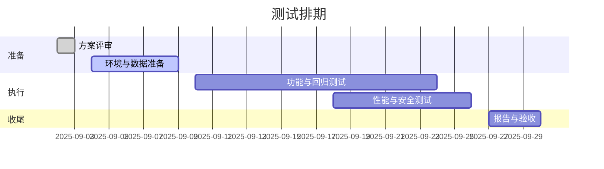

# 系统测试方案 (STP)

## 0. 文档元信息
- 版本：v0.1
- 作者/评审人：QA Team / 待定
- 创建/更新日期：2025-09-02
- 关联需求/任务：`docs/需求规格说明书/需求规格说明书.md`，`docs/概要设计说明书/概要设计说明书.md`
- 适用范围：飞机发动机QEC拆装智能化系统二期（全栈：后端API、前端Web、数据处理、集成接口）

### 占位符与待确认约定
- 占位符格式：使用尖括号或花括号表示，如 `<sap-sandbox-url>`、`{{qa_target_rps}}`
- 使用原则：若指标/地址/账号/阈值尚未确认，先以占位符记录，评审后替换为正式值
- 跟踪方式：占位符统一列于“附录 D. 占位符清单”，并在对应章节标注“见附录D”

## 1. 引言
### 1.1 背景与目标
在一期实现QEC拆装流程信息化基础上，二期引入AI能力以提升维修效率与资源优化。本测试方案旨在明确系统/集成/验收测试范围、方法、环境、数据与度量门槛，保证如下目标：
- 功能正确性与端到端一致性
- 非功能达标（性能、稳定性、安全、可靠性等）
- 与外部系统（SAP/文档管理/HR/工具管理）集成可用性
- 上线质量门禁与可追溯验收

### 1.2 范围（In-Scope）与不在范围（Out-of-Scope）
- In-Scope：维修知识库管理、维修规划及资源智能化、生产看板、发动机检测辅助、认证授权与审计、API/消息接口、数据治理与指标监控
- Out-of-Scope：SAP/HR/文档管理/工具管理系统的内部实现；物流运输环节；非项目要求的移动端专有特性

### 1.3 术语与缩写
参见需求/概要设计中的术语（QEC、OEC、SAP、EO/EB/SB、AI、NLP、KG、API、UI、AR）。

### 1.4 参考资料（SRS/PRD/DDS/ADR/接口规范/合规要求）
- `docs/需求规格说明书/需求规格说明书.md`
- `docs/概要设计说明书/概要设计说明书.md`
- `docker/` 与 `docker-compose.*.yaml`，`api/` 源码与接口规范

## 2. 测试对象与功能项
### 2.1 被测系统与边界
- 被测系统：QEC拆装智能化系统（后端 Flask API、前端管理端、数据/向量检索、外部系统集成）
- 系统边界：对内包含知识库、计划与资源智能化、看板、检测辅助子系统；对外通过 RESTful API/消息总线与 SAP、文档管理、HR、工具管理系统交互

### 2.2 功能项清单
| 功能 | 描述 | 风险等级 | 影响范围 | 依赖 |
|---|---|---|---|---|
| 维修手册数据接入与管理 (F-RMANUAL-001) | 多格式文件接入、分段、元数据、索引 | 高 | 知识检索/问答 | 存储、嵌入/索引、解析器 |
| 历史维修记录接入与管理 (F-RHIS-001) | 历史工单与记录接入、清洗与索引 | 中-高 | 问答、案例召回 | ETL、脱敏策略 |
| 维修经验库 (F-RKNOW-001) | 经验沉淀、标签化、复审机制 | 中 | 问答质量 | 元数据治理 |
| 工程文件接入 (F-RENG-001) | BOM/工艺/规范接入与条目化 | 中 | 检索、引用可解释性 | CSV/XLSX解析 |
| 关键词与索引 (F-KB-INDEX-001) | 词表、索引维度、重排策略 | 高 | 全局检索质量 | 词表治理、索引引擎 |
| 自然语言问答 (F-QA-NLU-001) | 语义检索增强生成、引用溯源 | 高 | 中台/应用端问答 | 向量检索、LLM |
| 手册检索与定位 (F-QA-MANUAL-LOCATE-001) | 精准定位章节/段落与跳转 | 高 | 工具化应用 | 手册索引、定位UI |
| 检索质量监控 (F-KB-QA-GOV-001) | 评测台、指标、门禁与回滚 | 高 | 发布稳定性 | 指标采集、看板 |
| 维修计划智能生成/调整 | 生成计划、冲突解决、流程管理 | 高 | 执行链路 | SAP指令、工作流 |
| 航材/人员/工具智能管理 | 资源分析与配置、约束校验 | 高 | 作业保障 | 资源主数据、HR/工具系统 |
| 生产看板 | 计划/进度/资源/工位可视化 | 高 | 管理端 | 实时数据、订阅通道 |
| 发动机检测辅助 | 任务、实时结果、报告与预警 | 中 | 检测作业 | 设备接口、AI分析 |

## 3. 测试策略与级别
### 3.1 测试级别
- 单元测试（模块级逻辑与数据处理）
- 集成测试（知识库-检索-问答、计划-资源、看板-实时数据）
- 系统测试（端到端业务流程、跨模块链路）
- 验收测试（基于业务场景与SLA/验收门槛）

### 3.2 测试类型
- 功能/回归/冒烟/探索/契约（OpenAPI/Schema）/兼容（浏览器）/可用性/可访问性
- 非功能：性能/容量/稳定性/可靠性/可恢复性/安全/合规

### 3.3 覆盖策略与优先级
- 风险导向：知识检索与计划智能化为P0；看板与检测辅助为P1
- 变化导向：词表/索引/发布策略变更、计划生成算法调整需扩充回归
- 关键路径优先：知识接入→索引→问答→引用；SAP指令→计划生成→执行→看板

## 4. 测试环境与配置
### 4.1 环境拓扑
```mermaid
graph TD
  U[用户/测试客户端] --> W[Web/管理端]
  U --> A[API(Flask)]
  A --> PG[(PostgreSQL/pgvector)]
  A --> R[(Redis/Cache)]
  A --> V[向量/嵌入服务]
  A --> X[SAP/HR/DMS/工具管理(外部)]
  W --> A
```

### 4.2 环境与配置清单
| 项目 | 值/版本 | 说明 |
|---|---|---|
| 部署方式 | Docker Compose / K8s (可选) | 参考 `docker/docker-compose.dify-plus.yaml` |
| 后端框架 | Python Flask（api/） | `api/app.py` |
| 数据库 | PostgreSQL 14+ / pgvector | 性能与检索评测使用 |
| 缓存 | Redis 6+ | 任务/会话/缓存 |
| 前端 | 管理端 Web | `admin/web/` |
| 监控 | Prometheus/Grafana（可选） | 性能与稳定性观测 |
| 资产 | Nginx 反向代理 | `docker/nginx/` |

### 4.3 依赖模拟与隔离策略
- 外部依赖（SAP/HR/DMS/工具管理）：优先使用契约测试与Mock服务；关键联调阶段进行沙箱环境验证
- 第三方模型/嵌入：提供降级/熔断与重试；性能与配额限制可配置

### 4.4 部署与初始化
```yaml
# 示例环境变量（占位符，请在本地/CI变量中配置）
APP_ENV: staging
DB_DSN: postgresql://<user>:<pass>@<host>:5432/<db>
CACHE_URL: redis://<host>:6379/0
VECTOR_PROVIDER: <local|cloud>
SAP_ENDPOINT: <sap-sandbox-url>
HR_ENDPOINT: <hr-sandbox-url>
DMS_ENDPOINT: <dms-sandbox-url>
TOOLS_ENDPOINT: <tools-sandbox-url>
EXTERNAL_TIMEOUT_MS: 5000
```

## 5. 测试数据管理
- 数据来源：脱敏的手册/工单/经验/工程文件样例，构造典型与边界数据集
- 策略：等价类/边界值/组合覆盖；构建基线数据用于回放（召回/引用核验用例集）
- 隐私与合规：敏感字段脱敏；外部数据以沙箱/匿名样本替代
- 生命周期：用例前置数据准备→执行后清理/回收；数据工厂脚本纳入 `api/tests/data/`

## 6. 测试用例设计与套件
### 6.1 用例设计方法与命名规范
- 命名：`<模块>_<子功能>_<场景>_<期望>`，例如 `KB_Manual_Upload_PDF_Success`
- 方法：等价类、边界值、判定表、状态迁移（文档状态机）、因果图（检索策略）

### 6.2 用例概览（节选）
| ID | 标题 | 优先级 | 类型 | 前置条件 | 步骤 | 期望结果 | 数据 | 自动化 | 溯源 |
|---|---|---|---|---|---|---|---|---|---|
| TC-KB-001 | 手册PDF上传并索引成功 | 高 | 接入/功能 | 已创建知识库 | 上传PDF→解析→分段→索引 | 文档状态=Enabled；分段>0 | 手册样本PDF | 是 | F-RMANUAL-001 |
| TC-KB-002 | 手册元数据缺失阻断上线 | 高 | 校验 | 无 | 上传缺失元数据文档 | 上线被阻断并提示 | 无 | 是 | F-RMANUAL-001 |
| TC-KB-010 | 问答：指定型号/版本召回并展示引用 | 高 | 功能/E2E | 已有生效版本 | 询问“启动失败处理？”并限定型号/版本 | 返回步骤+引用段落 | 问题模板 | 是 | F-QA-NLU-001 |
| TC-KB-011 | 手册定位精确章节跳转 | 高 | 功能/UI | 手册已索引 | 输入“复位燃油控制单元？” | 返回章节/页码/段落并跳转 | 查询集 | 是 | F-QA-MANUAL-LOCATE-001 |
| TC-KB-020 | 检索质量门禁未达阈值阻断发布 | 高 | 治理 | 测试台基线 | 对比两策略召回率<阈值 | 发布被阻断并出报告 | 用例基线 | 是 | F-KB-QA-GOV-001 |
| TC-PLAN-001 | 接收SAP维修指令生成计划 | 高 | 集成/功能 | SAP沙箱 | 拉取指令→生成计划 | 计划状态有效、任务拆解正确 | 指令样本 | 是 | 计划生成 |
| TC-PLAN-005 | 冲突资源自动重排 | 高 | 算法/集成 | 资源受限 | 模拟资源冲突→重排 | 冲突消除且约束满足 | 数据工厂 | 否 | 计划调整 |
| TC-RES-001 | 航材短缺预警 | 高 | 功能 | 航材库存阈值 | 创建计划消耗超阈值 | 产生预警事件 | 航材样本 | 是 | 航材管理 |
| TC-BOARD-001 | 看板实时刷新 | 高 | 系统/UI | 订阅通道可用 | 推送状态变更 | 看板即时更新 | 模拟流 | 是 | 看板 |
| TC-DETECT-001 | 新增检测任务并生成报告 | 中 | 功能/E2E | 设备沙箱/模拟器 | 创建任务→执行→生成报告 | 报告可下载、字段完整 | 模拟数据 | 否 | 检测辅助 |
| TC-AUTH-001 | RBAC权限控制与审计 | 高 | 安全 | 角色已配置 | 低权限上传/删除文档 | 操作被拒绝并留痕 | 账号样本 | 是 | 权限与审计 |

### 6.3 回归套件与冒烟套件
- 冒烟：核心路径最小集（接入→索引→问答→引用；指令→计划→看板）≤30分钟
- 回归：覆盖高风险与变更热点；检索策略/词表/版本发布必走

### 6.4 维修知识库管理模块测试设计

#### 6.4.1 范围与依据
- 范围：知识库（Dataset）层面的创建/编辑/删除/查询与权限控制；不覆盖问答与检索算法本身
- 设计依据：
  - 概要设计 4.3.1 维修知识库管理模块（知识录入/检索接口）
  - 概要设计 4.3.1.1 知识库构建与维护设计
  - 详细设计 3.2 知识库构建与维护模块（职责/边界/配置/性能/安全）
  - 详细设计 6 非功能需求（性能、SLA、安全、限流）
- 相关接口（REST）：
  - POST /v1/datasets（创建空知识库）
  - GET /v1/datasets?page=&limit=&keyword=（列表/检索）
  - GET /v1/datasets/{dataset_id}（详情）
  - PATCH /v1/datasets/{dataset_id}（更新）
  - DELETE /v1/datasets/{dataset_id}（删除）

#### 6.4.2 功能测试用例（CRUD 与查询）
| ID | 标题 | 优先级 | 前置条件 | 步骤 | 期望结果 | 溯源 |
|---|---|---|---|---|---|---|
| TC-KB-100 | 创建知识库-最小字段成功 | 高 | 具备有效凭据 | POST /v1/datasets {name} | 201/200；返回id、默认permission/indexing_technique等 | 概要4.3.1；详设3.2 |
| TC-KB-101 | 创建知识库-名称重复 | 中 | 已存在同名KB | POST 同名 | 4xx，错误码/消息符合规范；不创建重复 | 详设1.4/2.1命名规则 |
| TC-KB-102 | 创建知识库-权限枚举校验 | 中 | - | POST 各 permission=only_me/all_team_members/partial_members | 200；服务端落库值正确 | 概要4.3.1 接口 |
| TC-KB-103 | 创建知识库-索引与检索配置 | 中 | - | POST 指定 indexing_technique=high_quality/economy，embedding_model/retrieval_model | 200；配置可查询并持久化 | 详设3.2.1/3.2.7 |
| TC-KB-110 | 查询知识库列表-分页 | 高 | 存在≥25条KB | GET /v1/datasets?page=2&limit=10 | 200；返回10条，含total/meta；顺序稳定 | 详设REST风格 |
| TC-KB-111 | 查询知识库列表-关键词过滤 | 中 | 存在命中与不命中样本 | GET /v1/datasets?keyword=xxx | 200；仅返回名称/描述含xxx的KB | 概要4.3.1 检索接口 |
| TC-KB-112 | 查询知识库详情 | 高 | 已有KB | GET /v1/datasets/{id} | 200；字段齐全，时间ISO8601 | 详设1.4/字段规范 |
| TC-KB-120 | 更新知识库-修改描述与权限 | 高 | 已有KB | PATCH /v1/datasets/{id} {description,permission} | 200；再次GET可见更新 | 概要4.3.1 更新 |
| TC-KB-121 | 更新知识库-部分成员权限 | 中 | 团队成员多角色 | PATCH 设置 partial_members 列表 | 200；RBAC对齐，非成员访问被拒绝 | 详设3.4.4 权限矩阵 |
| TC-KB-122 | 更新知识库-检索/索引配置变更 | 中 | 已有KB | PATCH 调整 indexing/retrieval/embedding | 200；配置生效并影响后续入库策略 | 详设3.2.7 配置 |
| TC-KB-130 | 删除知识库-空知识库 | 高 | 无文档 | DELETE /v1/datasets/{id} | 200/204；列表中不可见 | 概要4.3.1 删除 |
| TC-KB-131 | 删除知识库-存在文档的处理 | 高 | KB含文档 | DELETE | 设计约定生效：允许删除则级联清理或进入回收状态；否则返回4xx并提示 | 详设3.2（按实现确认） |

补充说明：如产品实现为“软删除+后台清理”，期望包含状态字段或不可见策略，测试需据实际实现断言。

#### 6.4.3 接口测试用例（契约/校验/错误码）
- 契约校验：基于 OpenAPI/Schema（若提供）校验字段类型、必填、枚举、默认值；时间字段使用ISO8601；状态常量全大写（详设1.4）。
- 典型请求/响应验证：
  - 创建：name 非空与长度上限（例如≤128）；description 可选；permission 枚举；embedding/retrieval/indexing 参数组合合法
  - 列表：分页边界（page=1, limit=1；limit 大值）；keyword 特殊字符与URL编码
  - 详情：路径参数 id 为UUID 格式校验
  - 更新：局部更新与非法字段拒绝；partial_members 数组/成员ID格式校验
  - 删除：幂等性（重复删除返回 404 或 204）
- 错误码与HTTP状态：
  - 400 参数非法；401 未认证；403 无权限；404 资源不存在；409 冲突（如重名）；429 触发限流；5xx 服务异常
  - 业务错误码遵循模块段位（详设1.4：41xxxx/42xxxx/43xxxx），返回结构含 code/message

示例用例（节选）：
| ID | 标题 | 优先级 | 步骤 | 期望 |
|---|---|---|---|---|
| TC-KB-200 | 创建-缺少name | 高 | POST 无name | 400，code含参数缺失，message明确 |
| TC-KB-201 | 创建-名称过长 | 中 | POST name 长度>上限 | 400，校验失败 |
| TC-KB-202 | 更新-非法字段 | 中 | PATCH 包含未定义字段 | 400/422，拒绝并指明字段 |
| TC-KB-203 | 删除-不存在ID | 中 | DELETE 随机UUID | 404 |
| TC-KB-204 | 限流-短时突发 | 中 | 1s 内>阈值请求列表接口 | 部分请求 429，重试后恢复 |

#### 6.4.4 性能测试用例（目标与场景）
- 目标（对齐详设与SLA）：
  - 知识库列表查询：P95 ≤ 200ms；容量200 QPS（详设6.2）
  - 文档列表查询（参考）：P95 ≤ 500ms（详设3.2.8）
  - 创建/更新/删除：常规写操作 P95 ≤ 500ms（无重计算）
- 场景与验收：
  - KB列表峰值并发：RPS=200，持续10分钟；错误率<0.1%，P95≤200ms
  - 关键词检索混合：20% keyword 命中，80%未命中；延迟在目标内
  - 写操作低频压测：RPS=10（混合POST/PATCH/DELETE），P95≤500ms
  - 稳定性：持续60分钟不出现显著抖动或资源泄漏（CPU<70%，内存<75%）
- 观测：接入 Prometheus 指标（详设3.2.10），记录请求率、延迟直方图、错误率；输出趋势图

#### 6.4.5 安全测试用例（鉴权/RBAC/审计/限流）
- 鉴权：
  - 未携带JWT/API-KEY 访问任一接口→401
  - 携带无效/过期令牌→401；错误信息不泄露内部细节
- RBAC与数据域：
  - 角色矩阵（详设3.4.4）：所有者/管理员/编辑/只读
  - 用例：只读用户尝试 PATCH/DELETE→403；编辑可查改文档但不得改KB权限；partial_members 仅列内可见
- 访问控制：知识库级ACL生效；非成员无法GET详情/列表不返回隐私KB
- 限流：命中用户/IP/接口级限流（详设5.3）→返回429，包含重试提示
- 审计：创建/更新/删除操作在审计日志留痕（详设3.4.4.3）；记录 user_id、action、resource_type/resource_id、时间与IP
- 安全稳健性：基础OWASP Top 10 针对接口参数（注入/越权/对象ID枚举/错误信息暴露）

示例用例（节选）：
| ID | 标题 | 角色/前置 | 步骤 | 期望 |
|---|---|---|---|---|
| TC-KB-300 | 未认证访问被拒 | 无令牌 | GET /v1/datasets | 401 |
| TC-KB-301 | 只读用户更新被拒 | 只读角色 | PATCH /v1/datasets/{id} | 403 |
| TC-KB-302 | 非成员不可见 | 非成员用户 | GET /v1/datasets?keyword=私有 | 列表不包含私有KB |
| TC-KB-303 | 限流触发 | 普通令牌 | 短时间高频调用 | 429，含重试提示 |
| TC-KB-304 | 审计留痕 | 管理员 | 执行创建/更新/删除 | 审计表新增记录 |

#### 6.4.6 其他完善项（边界/并发/可用性）
- 名称/描述：支持中英文与特殊字符；前后空白处理；长度边界
- 并发创建同名：并发10→仅1成功，其余409；无脏写
- 并发更新：同一KB并发PATCH→最终一致；如实现乐观锁则校验版本冲突
- 软删除策略：回收站/延迟清理（若实现）；恢复可用性用例
- 监控与告警：失败率>5%、解析/索引队列积压>阈值触发告警（详设3.2.10）

#### 6.4.7 测试环境与可达性验证
- 知识库管理测试URL：http://app.anyremote.cn:8183/datasets
- 可达性检查结果：HTTP 200（仅访问页面，无数据写入）；后续接口测试需在该基础域名的API前缀下进行，并使用沙箱凭据
- 数据与账号：使用脱敏/沙箱账号；严格区分环境，避免修改生产数据

## 7. 非功能测试方案
### 7.1 性能/容量/稳定性目标
| 指标 | 目标/阈值 | 工况 | 说明 |
|---|---|---|---|
| 页面加载 | 普通≤2s，数据密集≤5s | 50并发/稳定10min | 参照SRS 4.1 |
| 问答响应 | 简单≤3s，复杂≤10s（或 `<qa_simple_p95_ms>`/`<qa_complex_p95_ms>`） | `<qa_target_rps>` RPS，混合查询集 | TopK≤8、外部依赖≤20%（可由 `<external_ratio>` 代替） |
| 计划生成 | 简单≤10s，复杂≤60s（或 `<plan_simple_sla_s>`/`<plan_complex_sla_s>`） | 指令批量 `<plan_batch_size>` 条 | 资源校验/冲突重排 |
| 错误率 | < 0.1% | 稳定运行 | 5xx/4xx（非用例导致） |
| 资源占用 | CPU<70%，内存<75%（或 `<cpu_threshold_pct>`/`<mem_threshold_pct>`） | 峰值60min | 生产等价环境 |
| 稳定性 | 24h 连续运行无泄漏 | 典型工作负载 | 监控无异常增长 |

说明：如目标未确认，临时以占位符记录，见附录D。

### 7.2 性能测试方法
```javascript
// k6 示例（占位，针对健康检查与问答接口）
import http from 'k6/http'
import { check, sleep } from 'k6'
export const options = { vus: 50, duration: '10m' }
export default function(){
  const res = http.get('https://example.com/api/health')
  check(res, { 'status is 200': r => r.status === 200 })
  sleep(1)
}
```

### 7.3 安全测试
- 依据 OWASP Top 10：注入、XSS、认证与会话、访问控制、敏感数据暴露、CSRF、日志与审计
- 工具：OWASP ZAP/手工渗透；凭据使用占位符与沙箱账户

### 7.4 兼容性/可用性/可恢复性/可靠性
- 兼容：Chrome/Firefox/Edge 最新2主版本；分辨率自适应
- 可用性：关键操作≤3步、空状态/错误状态友好
- 可恢复性：DB/缓存/向量服务异常的重试与幂等；作业可恢复
- 可靠性：备份/回滚策略验证（RTO≤4h，RPO≤1h）

## 8. 自动化测试计划
### 8.1 层次与比例（目标）
- 单元:集成:接口:UI:端到端 ≈ 40%:25%:20%:10%:5%

### 8.2 框架与目录结构
- 接口/单元：pytest + requests（`api/tests/`）
- UI：Playwright（`admin/web/tests/`，如无则新建）
- 契约：OpenAPI 校验（`api/openapi*.json` 若有；否则生成）
- E2E：关键路径脚本放置 `api/tests/e2e/`

### 8.3 稳定性提升策略
- 数据隔离（用例专用前后置）、等待重试、幂等请求ID、并发分组运行、截图与日志归档

### 8.4 覆盖与门禁
- 行覆盖率：后端≥70%；关键模块≥80%
- 必测用例：冒烟+高风险用例集全部通过
- 门禁：阻断/严重缺陷=0 方可合入主干/发布

## 9. CI/CD 集成
- 触发：PR/主干合并/定时基线
- 分阶段：lint→单元→集成→契约→UI/E2E（可并行）→性能基准（夜间）
- 产物与归档：测试报告、覆盖率、截图、性能趋势；存储于CI制品
 - 流水线文件：`<ci_pipeline_file>`（占位）
```yaml
# 示例（占位）：
stages:
  - test
  - perf
```

## 10. 里程碑与排期（建议）


## 11. 角色与职责
| 角色 | 职责 |
|---|---|
| 测试负责人 | 方案与计划、资源协调、质量门禁 |
| 测试工程师 | 用例与脚本、执行与缺陷跟踪、报告 |
| 开发负责人 | 缺陷修复、代码质量、技术支持 |
| 运维/DevOps | 环境与发布、监控告警、回滚策略 |
| 业务代表 | 验收与签署、场景确认 |

## 12. 入口与退出准则
### 12.1 入口（就绪）
- 环境通过健康检查（API 200/DB/Cache/向量服务可用/外部沙箱联通）
- 基线数据与账号就绪；监控仪表盘/日志链路可用
- 需求/设计冻结版本明确，风险评审完成

### 12.2 退出（验收）
- 功能通过率≥`<pass_rate_threshold>%`（默认95%），阻断/严重缺陷=0，主要缺陷关闭率≥`<defect_close_rate>%`（默认98%）
- 性能达标：7.1各项阈值满足（或以 `<perf_gate_p95_ms>`、`<error_rate_threshold>`、`<cpu_threshold_pct>`、`<mem_threshold_pct>` 指定），P95 延迟/错误率/资源占用在限内
- 稳定性：24h 运行无内存泄漏与异常增长；关键作业可恢复
- 文档齐备：报告、缺陷清单、回归基线、发布说明

## 13. 度量与报告
- 功能通过率、用例执行进度、缺陷趋势（新增/关闭/未决）、模块与风险覆盖率
- 性能指标（P50/P95、TPS、CPU/内存、错误率）、稳定性（重启次数、MTTR）
- 自动化占比与波动、脆弱用例列表与修复计划

## 14. 风险与应对
| 风险 | 影响 | 概率/严重度 | 缓解策略 | 兜底方案 |
|---|---|---|---|---|
| 外部系统不稳定/配额 | 联调失败/超时 | 中/高 | 沙箱与Mock、超时与重试、降级策略 | 暂停外链，内部可用 |
| 模型/嵌入服务限流 | 问答时延上升 | 中/中 | 预热与配额监控、缓存 | 切换本地/备用供应商 |
| 大文件解析失败 | 文档入库受阻 | 低/中 | 文件类型白名单、重试与人工校验 | 离线处理与补齐 |
| 数据脱敏不足 | 合规风险 | 低/高 | 脱敏规则/审计 | 使用合成数据 |
| 指标观测缺失 | 难以定位问题 | 中/中 | 接入监控/Tracing | 人工采样与限压 |

## 15. 变更与版本
- 记录方案修订与评审意见，按版本管理；关键门槛与指标变化需审批

## 16. 审批与签署
- 负责人/开发/测试/产品/运维签署与日期（上线前完成）

## 附录
### A. 需求-用例-缺陷可追溯矩阵（节选）
| 需求ID | 用例ID | 缺陷ID | 状态 |
|---|---|---|---|
| F-RMANUAL-001 | TC-KB-001/002 | - | 进行中 |
| F-QA-NLU-001 | TC-KB-010 | - | 进行中 |
| F-QA-MANUAL-LOCATE-001 | TC-KB-011 | - | 进行中 |

### B. 示例 HTTP 用例
```http
POST /v1/chat-messages HTTP/1.1
Content-Type: application/json

{"query":"X100启动失败怎么处理？","inputs":{"device_model":"X100","manual_version":"v2.0"}}
```

### D. 占位符清单
| 占位符 | 含义 | 用途章节 |
|---|---|---|
| <sap-sandbox-url> | SAP 沙箱地址 | 4.4 部署与初始化 |
| <hr-sandbox-url> | HR 沙箱地址 | 4.4 部署与初始化 |
| <dms-sandbox-url> | 文档管理沙箱地址 | 4.4 部署与初始化 |
| <tools-sandbox-url> | 工具管理沙箱地址 | 4.4 部署与初始化 |
| <qa_target_rps> | 问答目标RPS | 7.1 性能目标 |
| <qa_simple_p95_ms> | 简单问答P95延迟(ms) | 7.1 性能目标 |
| <qa_complex_p95_ms> | 复杂问答P95延迟(ms) | 7.1 性能目标 |
| <external_ratio> | 外部依赖占比上限 | 7.1 性能目标 |
| <plan_simple_sla_s> | 简单计划生成SLA(秒) | 7.1 性能目标 |
| <plan_complex_sla_s> | 复杂计划生成SLA(秒) | 7.1 性能目标 |
| <plan_batch_size> | 计划批量生成条数 | 7.1 性能目标 |
| <cpu_threshold_pct> | CPU阈值(%) | 7.1/12.2 门禁 |
| <mem_threshold_pct> | 内存阈值(%) | 7.1/12.2 门禁 |
| <perf_gate_p95_ms> | 性能门禁P95(ms) | 12.2 退出准则 |
| <error_rate_threshold> | 错误率门禁 | 12.2 退出准则 |
| <pass_rate_threshold> | 功能通过率门槛(%) | 12.2 退出准则 |
| <defect_close_rate> | 缺陷关闭率门槛(%) | 12.2 退出准则 |
| <ci_pipeline_file> | CI流水线文件路径 | 9 CI/CD 集成 |

### C. 澄清问题清单（待确认）
- 外部系统（SAP/HR/DMS/工具管理）沙箱地址与测试账号/数据配额？
- 问答与检索性能考核的目标RPS与高峰并发模型（工作日/班次）？
- 计划生成算法的约束边界与可接受近似/超时阈值？
- 设备检测接口模拟器/实物接入策略与安全边界？
- 监控与日志平台接入方式（Prometheus/Grafana/OTel/ELK）与阈值告警？
- 发布门禁的最终阈值（覆盖率/必测用例/缺陷等级阻断标准）？

## Checklists

### 完整性检查
- [ ] 核心章节完整，标题与编号规范
- [ ] 指标量化（延迟/吞吐/错误率/资源/稳定性/安全）
- [ ] 环境与数据可复现，脱敏合规
- [ ] 用例具备溯源与优先级，重大路径覆盖
- [ ] 自动化计划清晰，门禁阈值明确
- [ ] 报告与度量口径一致，可追踪

### 质量门禁清单
- [ ] Mermaid 图可渲染，表格字段齐全
- [ ] 示例不含敏感信息，使用占位符
- [ ] 入口/退出准则可执行且可验证
- [ ] 风险清单含缓解与兜底

