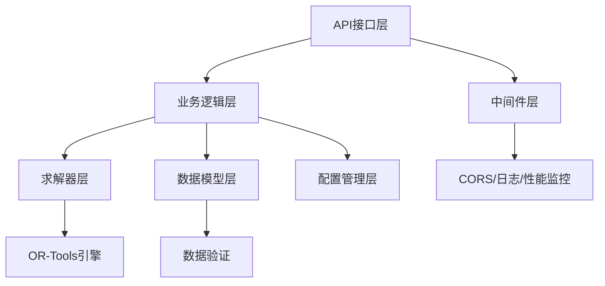

# 智能排程系统 (Intelligent Scheduling System)

基于Google OR-Tools CP-SAT求解器的发动机QEC维修计划智能调度引擎。

## 🎯 项目目标

通过AI技术智能化生成和调整发动机QEC（Quick Engine Change）维修计划，核心是优化航材、人员、工具、场地等关键资源的配置效率。

**最终目标**：建立一个能够响应实时变化、满足复杂业务约束、并以"总工时最短、成本最低、资源利用率最高"为导向的智能调度引擎。

## 🏗️ 系统架构

```
智能排程系统
├── 数据模型层 (models/)          # 核心业务实体和数据结构
├── 求解器层 (solvers/)           # 基于OR-Tools的约束求解引擎
├── 业务逻辑层 (services/)        # 排程服务、资源管理、事件处理
├── API接口层 (api/)              # RESTful API和中间件
├── 配置管理层 (config/)          # 策略模板和参数配置
└── 工具层 (utils/)               # 通用工具函数和助手类
```

## 🚀 核心功能

### 准备阶段智能排程
- **门禁管理**: 关键工装齐套、航材齐套、技术资料就绪等门禁检查
- **资源调配**: 行车、工位、人员等资源的智能分配和冲突避免
- **动态重排**: 基于ETA变更、SAP状态更新等事件的实时计划调整

### 多项目并行优化
- **全局资源池**: 跨项目的资源共享和优化分配
- **优先级策略**: 支持SLA保护、均衡公平、成本最小等策略模板
- **插单机制**: 紧急任务的插队处理和影响评估

### 约束求解引擎
- **硬约束**: 工作流程依赖、资源独占、资质匹配、物料齐全等
- **软约束**: 优才优用、减少等待、工作连续性等优化目标
- **性能优化**: 单工包≤5秒，多工包≤20秒的求解性能目标

## 🛠️ 技术栈

- **核心求解器**: Google OR-Tools CP-SAT Solver
- **开发语言**: Python 3.9+
- **数据验证**: Pydantic 2.5+
- **API框架**: FastAPI 0.104+
- **测试框架**: pytest 7.4+
- **代码质量**: black, isort, mypy, flake8

## 📦 安装和使用

### 环境要求
- Python 3.9 或更高版本
- UV包管理器（推荐）或pip

### 安装依赖

使用UV（推荐）：
```bash
# 安装依赖
uv sync

# 安装开发依赖
uv sync --dev
```

使用pip：
```bash
# 安装依赖
pip install -e .

# 安装开发依赖
pip install -e ".[dev]"
```

### 运行测试

```bash
# 使用UV运行测试
uv run pytest

# 运行特定测试类型
uv run pytest -m unit          # 单元测试
uv run pytest -m integration   # 集成测试
uv run pytest --cov=src        # 覆盖率测试
```

### 启动API服务

```bash
# 方法1: 使用主入口启动（推荐）
uv run python main.py

# 方法2: 指定主机和端口
uv run python main.py --host 0.0.0.0 --port 8000

# 方法3: 开发模式（自动重载）
uv run python main.py --reload

# 方法4: 配置检查
uv run python main.py --config-check

# 方法5: 求解器测试
uv run python main.py --test-solver
```

## 📚 API文档和接口使用

### 快速访问
启动服务后，访问以下地址：
- **API文档**: http://localhost:8000/docs
- **系统信息**: http://localhost:8000/info
- **健康检查**: http://localhost:8000/health
- **性能指标**: http://localhost:8000/metrics

### 🧪 API测试工具

项目提供了完整的API测试工具 `test_api.py`，支持：

```bash
# 运行所有API测试
uv run python test_api.py

# 测试特定接口
uv run python test_api.py --endpoint health
uv run python test_api.py --endpoint info
uv run python test_api.py --endpoint metrics

# 生成测试数据
uv run python test_api.py --generate-data

# 指定API服务器地址
uv run python test_api.py --base-url http://localhost:8000
```

### 📊 测试数据说明

`test_data.json` 包含完整的模拟数据集：

- **工作包 (work_packages)**: 3个不同优先级的测试工作包
- **任务 (jobs)**: 11个具有依赖关系的任务
- **资源 (resources)**: 5个技师，包含不同技能和工作时间
- **排程请求 (schedule_request)**: 完整的排程请求示例

### 🔌 主要API端点

#### 系统基础接口
- `GET /` - 系统根信息
- `GET /health` - 健康检查
- `GET /info` - 系统详细信息
- `GET /metrics` - 性能指标
- `GET /docs` - API文档

#### 准备阶段排程 (开发中)
- `POST /api/v1/prep/tasks/plan` - 生成准备排程
- `POST /api/v1/prep/events/apply` - 事件驱动重排
- `GET /api/v1/prep/summary` - 准备态汇总
- `POST /api/v1/prep/handovers/confirm` - 交接确认

#### 配置管理 (开发中)
- `POST /api/v1/config/priority-template:apply` - 策略模板切换
- `POST /api/v1/config/preemption:settings` - 插单护栏设置

#### 审计查询 (开发中)
- `GET /api/v1/audit/changes` - 变更日志查询

## 🏛️ 系统架构和模块运作逻辑

### 核心模块交互流程



### 📦 模块详细说明

#### 1. API接口层 (`src/api/`)
- **main.py**: FastAPI应用主入口，路由注册和应用配置
- **middleware.py**: 中间件管理，包含CORS、日志、性能监控、错误处理
- **prep_api.py**: 准备阶段相关API接口
- **config_api.py**: 配置管理API接口

**运作逻辑**:
1. 接收HTTP请求
2. 通过中间件进行预处理（CORS、日志、性能监控）
3. 路由到对应的处理函数
4. 调用业务逻辑层服务
5. 返回标准化响应

#### 2. 业务逻辑层 (`src/services/`)
- **排程服务**: 核心排程算法和业务规则
- **资源管理**: 资源分配和冲突检测
- **事件处理**: 外部事件的处理和响应
- **门禁管理**: 准备阶段门禁条件验证

**运作逻辑**:
1. 接收API层的业务请求
2. 验证业务规则和约束条件
3. 调用求解器进行优化计算
4. 处理求解结果并应用业务逻辑
5. 返回处理结果给API层

#### 3. 求解器层 (`src/solvers/`)
- **SolverFactory**: 求解器工厂，支持多种求解器类型
- **CPSATSolver**: 基于OR-Tools CP-SAT的约束求解器
- **SolverConfig**: 求解器配置和参数管理

**运作逻辑**:
1. 接收业务层的求解请求
2. 将业务问题转换为约束满足问题
3. 调用OR-Tools引擎进行求解
4. 解析求解结果
5. 返回优化方案给业务层

#### 4. 数据模型层 (`src/models/`)
- **Job**: 任务模型，包含工作内容和依赖关系
- **Resource**: 资源模型，包含人员、设备、工具等
- **WorkPackage**: 工作包模型，任务的集合
- **Schedule**: 排程结果模型

**运作逻辑**:
1. 定义核心业务实体
2. 提供数据验证和序列化
3. 管理实体间的关系和约束
4. 支持数据持久化和查询

#### 5. 配置管理层 (`src/config/`)
- **settings.py**: 应用配置管理，支持环境变量和配置文件
- **策略模板**: 不同的优化策略配置
- **业务参数**: 可调整的业务规则参数

**运作逻辑**:
1. 加载和验证配置参数
2. 提供配置热更新机制
3. 管理不同环境的配置差异
4. 支持策略模板的动态切换

### 🔄 典型业务流程

#### 排程请求处理流程
1. **API接收**: 前端发送排程请求到 `/api/v1/prep/tasks/plan`
2. **数据验证**: 中间件和模型层验证请求数据格式和业务规则
3. **业务处理**: 服务层解析任务依赖、资源需求和约束条件
4. **求解优化**: 求解器层将问题转换为CSP并调用OR-Tools求解
5. **结果处理**: 业务层处理求解结果，应用业务规则和后处理
6. **响应返回**: API层返回标准化的排程结果

#### 事件驱动重排流程
1. **事件接收**: 外部系统推送状态变更事件
2. **事件验证**: 验证事件格式和业务有效性
3. **影响分析**: 分析事件对当前排程的影响范围
4. **重排决策**: 根据影响程度决定是否触发重排
5. **增量求解**: 使用增量求解算法优化受影响的部分
6. **结果应用**: 更新排程计划并通知相关系统

## 🧪 开发指南

### 代码规范
项目遵循以下编码规范：
- PEP 8 Python代码风格
- 类型注解：所有公共函数必须包含类型注解
- 文档字符串：所有公共类和函数必须包含详细的docstring
- 测试覆盖：核心逻辑测试覆盖率 > 90%

### 代码质量检查
```bash
# 代码格式化
uv run black src tests
uv run isort src tests

# 类型检查
uv run mypy src

# 代码风格检查
uv run flake8 src tests
```

### 项目结构
```
or-tools/
├── src/                      # 源代码
│   ├── api/                  # API接口层
│   │   ├── main.py          # FastAPI应用主入口
│   │   ├── middleware.py    # 中间件（CORS、日志、性能监控）
│   │   ├── prep_api.py      # 准备阶段API
│   │   └── config_api.py    # 配置管理API
│   ├── models/               # 数据模型层
│   │   ├── job.py           # 任务模型
│   │   ├── resource.py      # 资源模型
│   │   └── schedule.py      # 排程模型
│   ├── services/             # 业务逻辑层
│   │   ├── scheduling.py    # 排程服务
│   │   ├── resource_mgmt.py # 资源管理
│   │   └── event_handler.py # 事件处理
│   ├── solvers/              # 求解器层
│   │   ├── factory.py       # 求解器工厂
│   │   ├── cpsat_solver.py  # CP-SAT求解器
│   │   └── config.py        # 求解器配置
│   ├── schemas/              # 数据结构定义
│   ├── core/                 # 核心功能模块
│   │   ├── constants.py     # 系统常量
│   │   └── exceptions.py    # 异常定义
│   ├── config/               # 配置管理
│   │   └── settings.py      # 应用设置
│   └── utils/                # 工具函数库
├── tests/                    # 测试代码
│   ├── unit/                 # 单元测试
│   ├── integration/          # 集成测试
│   ├── fixtures/             # 测试数据
│   └── mocks/                # 模拟对象
├── docs/                     # 需求和设计文档
├── scripts/                  # 可执行脚本
├── test_api.py              # API测试工具
├── test_data.json           # 测试数据集
├── main.py                  # 应用主入口
└── .cursor/docs/             # 项目文档
```

### 🔧 故障排除

#### 常见问题和解决方案

**1. API服务器启动失败**
```bash
# 检查配置
uv run python main.py --config-check

# 检查端口占用
lsof -i :8000

# 查看详细错误信息
uv run python main.py --debug
```

**2. 依赖安装问题**
```bash
# 重新安装依赖
uv sync --reinstall

# 检查Python版本
python --version  # 需要 >= 3.9

# 安装缺失的包
uv add pydantic-settings requests
```

**3. CORS跨域问题**
- 检查前端访问地址是否在CORS允许列表中
- 默认允许: `localhost:3000`, `localhost:8080`
- 修改配置: `src/config/settings.py` 中的 `cors_origins`

**4. API测试失败**
```bash
# 确保服务器正在运行
curl http://localhost:8000/health

# 运行单个测试
uv run python test_api.py --endpoint health

# 检查网络连接
ping localhost
```

### 📊 性能监控

系统提供了内置的性能监控功能：

```bash
# 查看性能指标
curl http://localhost:8000/metrics

# 响应示例
{
  "metrics": {
    "total_requests": 42,
    "slow_requests": 2,
    "error_requests": 1,
    "average_response_time": 0.156
  },
  "timestamp": "2025-08-15T18:07:18.008540"
}
```

**性能指标说明**:
- `total_requests`: 总请求数
- `slow_requests`: 慢请求数（>5秒）
- `error_requests`: 错误请求数
- `average_response_time`: 平均响应时间（秒）

### 💡 使用示例

#### 1. 基础API调用示例

```python
import requests

# 健康检查
response = requests.get("http://localhost:8000/health")
print(response.json())

# 获取系统信息
response = requests.get("http://localhost:8000/info")
system_info = response.json()
print(f"系统名称: {system_info['system']['name']}")
print(f"功能特性: {len(system_info['features'])}个")
```

#### 2. 使用测试数据进行开发

```python
import json

# 加载测试数据
with open('test_data.json', 'r', encoding='utf-8') as f:
    test_data = json.load(f)

# 获取工作包信息
work_packages = test_data['work_packages']
print(f"测试工作包数量: {len(work_packages)}")

# 获取任务信息
jobs = test_data['jobs']
for job in jobs:
    print(f"任务: {job['name']}, 工期: {job['base_duration_hours']:.1f}小时")
```

#### 3. 前端集成示例

```javascript
// JavaScript/TypeScript 前端调用示例
const API_BASE_URL = 'http://localhost:8000';

// 获取系统健康状态
async function checkHealth() {
    try {
        const response = await fetch(`${API_BASE_URL}/health`);
        const data = await response.json();
        console.log('系统状态:', data.status);
        return data;
    } catch (error) {
        console.error('健康检查失败:', error);
    }
}

// 获取系统信息
async function getSystemInfo() {
    try {
        const response = await fetch(`${API_BASE_URL}/info`);
        const data = await response.json();
        return data;
    } catch (error) {
        console.error('获取系统信息失败:', error);
    }
}
```

### 🎯 最佳实践

#### 开发环境配置
1. **使用UV包管理器**: 更快的依赖解析和安装
2. **启用自动重载**: 开发时使用 `--reload` 参数
3. **配置IDE**: 设置Python解释器为项目虚拟环境
4. **代码格式化**: 配置IDE自动运行black和isort

#### API使用建议
1. **错误处理**: 始终检查HTTP状态码和响应格式
2. **超时设置**: 为API调用设置合理的超时时间
3. **重试机制**: 对于网络错误实现指数退避重试
4. **日志记录**: 记录API调用的关键信息用于调试

#### 性能优化
1. **并发控制**: 避免同时发起过多API请求
2. **缓存策略**: 对不经常变化的数据进行缓存
3. **分页查询**: 对大量数据使用分页机制
4. **监控指标**: 定期检查 `/metrics` 端点的性能数据

#### 测试策略
1. **单元测试**: 覆盖核心业务逻辑
2. **集成测试**: 测试API端到端功能
3. **性能测试**: 验证求解器性能目标
4. **回归测试**: 确保新功能不破坏现有功能

## 📖 文档

- [需求文档](docs/requirements.md) - 业务需求和功能规格
- [开发设计文档](docs/development_plan.md) - 技术设计和实施路径
- [API契约](docs/api_contract.md) - API接口规范
- [测试场景](docs/test_scenarios.md) - 测试用例和验收标准

## 🤝 贡献指南

1. Fork 项目
2. 创建特性分支 (`git checkout -b feature/AmazingFeature`)
3. 提交更改 (`git commit -m 'Add some AmazingFeature'`)
4. 推送到分支 (`git push origin feature/AmazingFeature`)
5. 开启 Pull Request

## 📄 许可证

本项目采用 MIT 许可证 - 查看 [LICENSE](LICENSE) 文件了解详情。

## 📞 联系方式

- 项目维护者: Development Team
- 邮箱: dev@company.com
- 项目链接: https://github.com/company/intelligent-scheduling

## 🙏 致谢

- [Google OR-Tools](https://developers.google.com/optimization) - 强大的优化工具库
- [FastAPI](https://fastapi.tiangolo.com/) - 现代化的Python Web框架
- [Pydantic](https://pydantic-docs.helpmanual.io/) - 数据验证和设置管理
