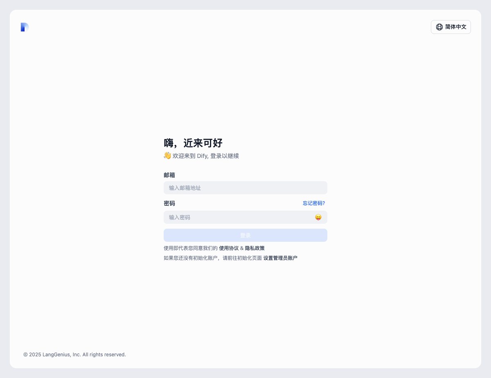

# Dify 登录页按钮与功能说明（拦截于访问 /datasets 时）

> 访问 http://app.anyremote.cn:8183/datasets 被重定向至登录页，因此本次记录为“登录页”元素与截图。若需继续抓取“数据集”页的按钮/功能，请提供可用的登录账号。

## 截图

## 可点击元素与功能

- **语言切换按钮：**
  - 文本：`简体中文`
  - 作用：打开语言选择菜单，用于切换界面语言。

- **邮箱输入框：**
  - 标签：`邮箱`
  - 作用：输入登录邮箱。

- **密码输入框：**
  - 标签：`密码`
  - 作用：输入登录密码。
  - 右侧表情按钮：`😝`
    - 作用：切换密码可见/隐藏（显示或隐藏密码明文）。

- **登录按钮：**
  - 文本：`登录`
  - 当前状态：禁用（需要填写合法的邮箱和密码才会启用）。

- **忘记密码链接：**
  - 文本：`忘记密码？`
  - 跳转：`/reset-password?`
  - 作用：进入重置密码流程。

- **使用协议链接：**
  - 文本：`使用协议`
  - 跳转：`https://dify.ai/terms`

- **隐私政策链接：**
  - 文本：`隐私政策`
  - 跳转：`https://dify.ai/privacy`

- **初始化管理员账户链接：**
  - 文本：`设置管理员账户`
  - 跳转：`/install`
  - 作用：如果系统尚未初始化，可前往创建管理员账户。

## 说明
- 由于 `/datasets` 受保护，未登录会被重定向至 `/signin`。
- 提供登录凭据后，我可以：
  - 进入“数据集”页，列出页面上的按钮/菜单/操作项及其功能。
  - 截取“数据集”页的整页或关键区域截图。
  - 更新本 Markdown 文档，追加“数据集”页的详细说明与截图。
